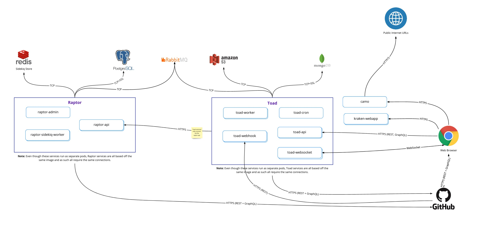

<div align="center">
  
</div>

[Website](https://www.zenhub.com/) • [On-Premise](https://www.zenhub.com/enterprise) • [Releases](https://www.zenhub.com/enterprise/releases/) • [Blog](https://blog.zenhub.com/) • [Chat (Community Support)](https://help.zenhub.com/support/solutions/articles/43000556746-zenhub-users-slack-community)

**ZenHub On-Premise** is the only team collaboration solution built for GitHub Enterprise Server. Plan roadmaps, use taskboards, and generate automated reports directly from your team’s work in GitHub. Always accurate.

## Table of Contents

- [1. ZenHub On-Premise Variants](#1.-ZenHub-On-Premise-Variants)
- [2. Terms of Use](#2.-Terms-of-Use)
- [3. Architecture](#3.-Architecture)
- [4. Requirements](#4.-Requirements)
  - [4.1 Kubernetes](#4.1-Kubernetes)
  - [4.2 PostgreSQL](#4.2-PostgreSQL)
  - [4.3 MongoDB](#4.3-MongoDB)
  - [4.4 RabbitMQ](#4.4-RabbitMQ)
  - [4.5 Redis](#4.5-Redis)
- [5. Configuration](#5-Configuration)
  - [5.1 Docker Registry](#5.1-Docker-Registry)
  - [5.2 Resource Scaling](#5.2-Resource-Scaling)
  - [5.3 Ingress](#5.3-Ingress)
- [6. Deployment](#6-Deployment)
  - [6.1 Sanity Check](#6.1-Sanity-Check)
  - [6.2 Application Check](#6.2Application-Check)
- [7. Upgrades](#7-Upgrades)
  - [7.1 From v2 to v3](#7.1-From-v2-to-v3)
  - [7.2 From v3 to v3.x](#7.2-From-v3-to-v3.x)

## 1. ZenHub On-Premise Variants

**ZenHub On-Premise** comes in two variants:

1. **ZenHub for Kubernetes**
2. **ZenHub as a VM**

Both variants ship the same application but the distribution and deployment strategy is different between the two. **ZenHub for Kubernetes** is deployed to your existing Kubernetes cluster and is typically recommended for customers with large amounts of data and users. This variant offers the best scalability and performance, but requires a dedicated SRE team to manage. **ZenHub as a VM** is distributed as a VM image which can be deployed to a private or public cloud solution. The entire application will run from a single VM which makes it easy to setup, configure and manage. This variant is ideal for smaller teams who are just getting started with ZenHub. It is possible to upgrade the **ZenHub as a VM** variant to a **ZenHub for Kubernetes** down-the-road, however, moving from a Kubernetes deployment back to a VM is not supported at this time.

Below is a table illustrating the main differences and our recommendations:

|                               | **ZenHub for Kubernetes** | **ZenHub as a VM** |
|:------------------------------|:--------------------------|:-------------------|
| **Deployment Package**        | Kubernetes Manifests      | OVA or AMI image   |
| **High Availability**         | ✅                         |                    |
| **Configuration Flexibility** | ✅                         |                    |
| **External Database Support** | ✅                         |                    |
| **Easy To Install**           |                           | ✅                  |
| **Built-in Logging**          |                           | ✅                  |
| **Built-in File Storage**     |                           | ✅                  |

> ⚠️ **NOTE:** This repository focuses on the documentation and instructions for **ZenHub for Kubernetes**. For instructions on how to install, configure and use **ZenHub as a VM** please view: https://help.zenhub.com/support/solutions/43000042880 or reach out to us via https://www.zenhub.com/enterprise for assistance.

## 2. Terms of Use

Please note that this repository is only provided for paying customers of **ZenHub On-Premise**. If you have not yet purchased an Enterprise license of ZenHub please contact us via https://www.zenhub.com/enterprise.

Please review the [LICENSE](/LICENSE) in this repository for additional details.

## 3. Architecture

**ZenHub** is a web application built with microservices. To help you understand the various components of ZenHub and the names of services, please review the following diagram:

<div align="center">
  
</div>

Please note the following:
- ZenHub ships with two backend technologies we call **Raptor** and **Toad**.
- Raptor and Toad are both made up of several microservices (eg. `raptor-admin`, `raptor-api`, `toad-webhook`, etc...)
- ZenHub requires the use of two databases: **MongoDB** and **PostgreSQL**.
- ZenHub requires the use of one instances of **Redis**. We recommend this instance is managed externally as it requires data persistence.
- ZenHub requires the use of a message broker via **RabbitMQ**.
- ZenHub services will require a persistent connection to your GitHub Enterprise Server.

> ⚠️ **NOTE:** In total ZenHub makes use of 3 Redis instance. Two of those instances are managed by the application itself and do not require any external management. For one of them we strongly recommend having it managed externally. In the future we hope to simplify the architecture so that only 1 instance instead of Redis is used across the entire application.

> ⚠️ **NOTE:** Not pictured above is the requirement for an external file storage solution that is compatible with the S3 bucket API. File storage is required to allow ZenHub users to upload attachments for issues and comments.

> ⚠️ **NOTE:** Not pictured above is the requirement for some kind of logging and monitoring solution. *ZenHub for Kubernetes* does not ship with its own logging and monitoring service.

## 4. Requirements

### 4.1 Kubernetes

In order to get started with ZenHub, you must have an existing Kubernetes cluster setup. You should:

- Be using Kubernetes version 1.16 or greater
- Have `kubectl` installed locally with credentials to access the cluster
- Create a dedicated Kubernetes namespace. Grant your user full access to that namespace.
- Have the capability to pull the Docker images from ZenHub's public Docker registry or have access to a private Docker registry where you can push images (and the cluster should have the ability to pull from that private registry)

### 4.2 PostgreSQL

ZenHub will require a connection to a PostgreSQL database. We recommend version 11.9 or greater.

> ⚠️ **NOTE:** We strongly recommend running this database outside the Kubernetes cluster via a database provider.

### 4.3 MongoDB

ZenHub will require a connection to a MongoDB database. MongoDB version 3.6 is required. At the moment ZenHub does **not** support MongoDB version 4.0 or greater.

> ⚠️ **NOTE:** We strongly recommend running this database outside the Kubernetes cluster via a database provider.

### 4.4 RabbitMQ

ZenHub will require a connection to RabbitMQ. We recommend the latest 3.x version.

### 4.5 Redis

ZenHub makes use of 1 externally managed Redis instance. This Redis instance that is used by our `raptor-sidekiq-worker` service requires data persistence. We recommend the latest 5.x version.

There are two additional Redis instanceses that will run inside the cluster via our configuration. You do not need to worry about those.

## 5. Configuration

All configuration for ZenHub is done via `kustomize` configuration files. The main file you will want to edit is the `sample/kustomization.yaml` file.

Please review the comments therein as they describe the various section that will require configuration. Areas that will require your attention are marked with `[EDIT]` prefixes.

### 5.1 Docker Registry

**Using ZenHub's Public Registry**

The default configuration file assumes your cluster will have access to pull Docker images from our public registry at: `us.gcr.io/zenhub-public`. In order to pull images from there you will need to authenticate.

- Along with your ZenHub license, there will be a `dockerpassword` file which contains a base64 encoded password.
- You will need to generate a `kubernetes.io/dockerconfigjson` secret with the following command (where `<namespace>` is the name of the Kubernetes namespace you will be deploying to):

  ```bash
  kubectl -n <namespace> create secret docker-registry zenhub-docker-registry-credentials \
  --docker-server=https://us.gcr.io \
  --docker-username=_json_key \
  --docker-email=docker@zenhub.io \
  --docker-password="$(cat dockerpassword | base64 --decode)"
  ```  

The secret name `zenhub-docker-registry-credentials` will be expected by ZenHub deployments.

**- NOT IMPLEMENTED -** **Using Your Private Registry**

Alternatively, you can choose to configure the cluster to pull images from you own private registry. To do this, edit your `kustomization.yaml` file, and change the following (where `your_own_registry` is the hostname of your private registry):

```yaml
images:
- name: kraken-webapp
  newName: <your_own_registry>/kraken-webapp
  newTag: enterprise-2.44
- name: raptor-backend
  newName: <your_own_registry>/raptor-backend
  newTag: enterprise-2.44
- name: toad-backend
  newName: <your_own_registry>/toad-backend
  newTag: enterprise-2.44
- name: kraken-extension
  newName: <your_own_registry>/kraken-extension
  newTag: enterprise-2.44
- name: sanitycheck
  newName: <your_own_registry>/sanitycheck
  newTag: enterprise-2.44

patchesStrategicMerge:
  - set-custom-pull-image-secret.yaml
```

This will configure all the deployments to use your registry and remove the expected `imagePullSecret` which would usually store the Docker credentials.

Finally, you will need to pull the images from our registry and upload them to your registry. You can do this via the following script:

```bash
# Authenticate against our registry
docker login -u _json_key -p "$(cat dockerpassword | base64 --decode)" https://us.gcr.io

# Push, tag and pull ZenHub images into your registry
your_registry=<your_own_registry_without_trailing_slash>
tag=enterprise-2.44
images="kraken-webapp toad-backend raptor-backend sanitycheck kraken-extension"
for i in $(echo $images); do docker pull us.gcr.io/zenhub-public/${i}:${tag} && docker tag us.gcr.io/zenhub-public/${i}:master ${your_registry}/${i}:${tag} && docker push ${your_registry}/${i}:${tag}; done
```

### 5.2 Resource Scaling

The base configuration ships with the minimum resources applied for all Kubernetes items. If your ZenHub instance handles large volumes you will want to modify the resources accordingly. Most of the deployments have autoscalling based on CPU usage but you might want to scale a deployment to a specific value. Here how to do this using `kustomize`:

Let's say you want to allow `raptor-api` to scale up to 30 replicas:

```yaml
# kustomization.yaml
patchesStrategicMerge:
  - hpa-raptor-api.yaml
```

```yaml
# hap-raptor-api.yaml
apiVersion: autoscaling/v2beta2
kind: HorizontalPodAutoscaler
metadata:
  name: raptor-api
spec:
  minReplicas: 5
  maxReplicas: 30
```

Or, you can modify the number of Sidekiq workers to allow for more parallel data processing:

```yaml
# kustomization.yaml
patchesStrategicMerge:
  - deployment-raptor-worker.yaml
```

```yaml
# deployment-raptor-worker.yaml
apiVersion: apps/v1
kind: Deployment
metadata:
  name: raptor-sidekiq-worker
spec:
  replicas: 10
```

### 5.3 Ingress

# Ingress

By default, we don't make any assumptions about the type of Ingress that is used with the cluster. It will be your responsibility to expose ZenHub through your prefered Ingress. The only requirement from the application side is that your Ingress targets the `nginx-gateway` service on port 80.

The provided manifests exposes ZenHub behind a single ClusterIP service, listening on port 80. You will need to setup and configure HTTPS through your Ingress (SSL configuration is not within the scope of "ZenHub for Kubernetes").

An example of the ClusterIP definition:

```yaml
apiVersion: v1
kind: Service
metadata:
  name: nginx-gateway
spec:
  type: ClusterIP
  ports:
    - name: http
      port: 80
      targetPort: 80
```

An example of the Ingress definition:

```yaml
apiVersion: extensions/v1beta1
kind: Ingress
  name: zenhub-ingress
spec:
  rules:
  - host: zenhub.yourcompany.com
    http:
      paths:
      - backend:
          serviceName: nginx-gateway
          servicePort: 80
```

> ⚠️**NOTE:** These examples don't make any assumptions about your cluster. They might not work exactly as shown as they could be missing some annotations to interoperate with your existing Ingress definition.

> ⚠️ **NOTE:** TLS is not taken into account here, depending on what is installed on your cluster, it could also be handled by the Ingress

> ⚠️ **NOTE:** If you are using SAML SSO or LDAP for your GitHub Enterprise Server, ensure the top and second level domain used by ZenHub are identical to that used by GitHub. This will help ensure that ZenHub can retrieve public assets (like user avatars) from GitHub.

## 6. Deployment

When you are ready to deploy your cluster, you can review the diff via:

```bash
kubectl diff -k .
```

If everything looks correct, you can deploy the cluster via:

```bash
kubectl apply -k .
```

### 6.1 Sanity Check

Due to the large number of services deployed, if something isn't working properly it may be difficult to diagnose the source of the problem. For this reason, we have included a `sanitycheck` utility which scans the cluster and checks for common problems.

You review the results of the check by checking the logs of the `<name-prefix>-sanitycheck` Kubernetes Job.

The sanity check will:

- Ensure a connection can be established to MongoDB, PostgreSQL, RabbitMQ and Redis
  - Hostname resolves
  - Port is open
  - Credentials to open database/cache connection
- Ensure a connection can be established to the GitHub Enterprise server
  - Hostname resolves
  - Port is open
- Ensure a connection can be established to the file storage
  * Hostname resolves
  * Can write a file and delete it after

The `sanitycheck` script will execute every 10 seconds until all the checks have passed. If the Job status is "Complete", all the checks were successful.

### 6.2 Application Check

To verify that you deployment was successful, you should be able to visit the ZenHub application, log into the webapp, load a workspace, and see a board with issues. Additionally, a good test is to run ZenHub in two separate browser tabs, then (in the first tab) move an issue on the board from one pipeline to another. Then look in the second tab and verify that the issue also moved.

## 7. Upgrades

### 7.1 From v2 to v3

Documentation coming soon

### 7.2 From v3 to v3.x

Documentation coming soon
