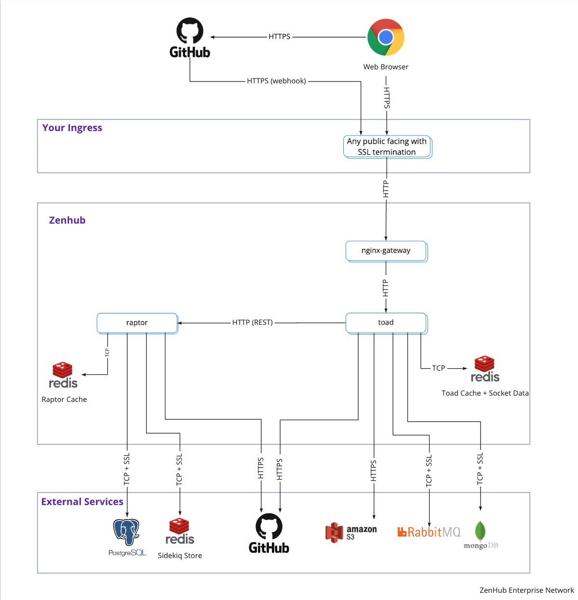

  

[Website](https://www.zenhub.com/) • [On-Premise](https://www.zenhub.com/enterprise) • [Releases](https://www.zenhub.com/enterprise/releases/) • [Blog](https://blog.zenhub.com/) • [Chat (Community Support)](https://help.zenhub.com/support/solutions/articles/43000556746-zenhub-users-slack-community)

**ZenHub Enterprise On-Premise** is the only team collaboration solution built for GitHub Enterprise Server. Plan roadmaps, use taskboards, and generate automated reports directly from your team’s work in GitHub. Always accurate.

## Table of Contents

- [1. About ZenHub Enterprise On-Premise](#1-zenhub-on-premise-variants)
  - [1.1 What is ZenHub Enterprise On-Premise 3 (ZHE3)?](#11-what-is-zenhub-enterprise-on-premise-3-zhe3)
  - [1.2 Why is ZHE3 important?](#12-why-is-zhe3-important)
  - [1.3 How do we set up ZHE3?](#12-how-do-we-set-up-zhe3)
  - [1.4 How do we migrate from ZHE2 to ZHE3?](#14-how-do-we-migrate-from-zhe2-to-zhe3)
- [2. Terms of Use](#2-terms-of-use)
- [3. Architecture](#3-architecture)
- [4. Next Steps](#4-next-steps)

## 1. About ZenHub Enterprise On-Premise

### 1.1 What is ZenHub Enterprise On-Premise 3 (ZHE3)?
ZHE3 is ZenHub's next-generation fully-containerized ZenHub Enterprise On-Prem infrastructure, built on a Kubernetes platform. ZHE3 replaces the outgoing VM-based ZHE2 architecture.

ZHE3 comes in two variants:

1. **ZenHub for Kubernetes**
2. **ZenHub as a VM**

Both variants ship the same application but the distribution and deployment strategy is different between the two. **ZenHub for Kubernetes** is deployed to your existing Kubernetes cluster and is typically recommended for customers with large amounts of data and users. This variant offers the best scalability and performance, but requires a dedicated SRE team to manage. **ZenHub as a VM** is distributed as a VM image which can be deployed to a private or public cloud solution. The entire application will run from a single VM and be orchestrated by a lightweight Kubernetes binary, which makes it easy to set up, configure and manage. This variant is ideal for smaller teams who are just getting started with ZenHub. It is possible to upgrade the ZenHub as a VM variant to a ZenHub for Kubernetes down-the-road, however, moving from a Kubernetes deployment back to a VM is not supported at this time.

Below is a table illustrating the main differences and our recommendations:

|                               | **ZenHub for Kubernetes** | **ZenHub as a VM** |
|:------------------------------|:--------------------------|:-------------------|
| **Deployment Package**        | Kubernetes Manifests      | OVA or AMI image   |
| **High Availability**         | ✅                         |                    |
| **Configuration Flexibility** | ✅                         |                    |
| **External Database Support** | ✅                         |                    |
| **Easy To Install**           |                           | ✅                  |
| **Built-in Logging**          |                           | ✅                  |
| **Built-in File Storage**     |                           | ✅                  |

### 1.2 Why is ZHE3 important?
- Lay the groundwork for near-parity with ZenHub Cloud release cycle ✅
- Improved options for scalability ✅
- Remove dependence on old infrastructure ✅
- Deploy ZenHub in the same deployment paradigm as your other applications ✅
### 1.3 How do we set up ZHE3?
- For **ZenHub for Kubernetes**, please refer to the [**k8s-cluster**](https://github.com/ZenHubHQ/zenhub-enterprise/tree/master/k8s-cluster) directory.
- For **ZenHub as a VM**, please refer to the [**virtual-machine**](https://github.com/ZenHubHQ/zenhub-enterprise/tree/master/virtual-machine) directory.
### 1.4 How do we migrate from ZHE2 to ZHE3?
The *basic* steps to migrate from your existing ZHE2 machine to ZHE3 are:
1. Decide if you want to deploy **ZenHub for Kubernetes** or **ZenHub as a VM**.
2. Deploy a ZHE3 "landing zone" to prepare for the migration.
3. Gather data from the existing ZHE2 source instance.
4. Move the data to a workstation/jump box.
5. Upload the data to your ZHE3 landing zone.

These steps are explained in much greater detail in [**k8s-cluster**](https://github.com/ZenHubHQ/zenhub-enterprise/tree/master/k8s-cluster) and [**virtual-machine**](https://github.com/ZenHubHQ/zenhub-enterprise/tree/master/virtual-machine).

## 2. Terms of Use

Please note that this repository is only provided for paying customers of **ZenHub Enterprise On-Premise**. If you have not yet purchased an Enterprise license of ZenHub please contact us via https://www.zenhub.com/enterprise.

Please review the [LICENSE](/LICENSE) in this repository for additional details.

## 3. Architecture

**ZenHub** is a web application built with microservices. To help you understand the various components of ZenHub and the names of services, please review the following diagram:

  

Please note the following:
- ZenHub ships with two backend technologies we call **Raptor** and **Toad**.
- Raptor and Toad are both made up of several microservices (eg. `raptor-admin`, `raptor-api`, `toad-webhook`, etc...)
- ZenHub requires the use of two databases: **MongoDB** and **PostgreSQL**.
- ZenHub requires the use of one instances of **Redis**. We recommend this instance is managed externally (internal for ZenHub as a VM) as it requires data persistence.
- ZenHub requires the use of a message broker via **RabbitMQ**.
- ZenHub services will require a persistent connection to your GitHub Enterprise Server.

> ⚠️ **NOTE:** In total ZenHub makes use of 3 Redis instance. Two of those instances are managed by the application itself and do not require any external management. For one of them we strongly recommend having it managed externally. In the future we hope to simplify the architecture so that only 1 instance instead of Redis is used across the entire application.

> ⚠️ **NOTE:** Not pictured above is the requirement for an external file storage solution that is compatible with the S3 bucket API (ZenHub as a Kubernetes cluster only—local storage is used for the VM). File storage is required to allow ZenHub users to upload attachments for issues and comments.

> ⚠️ **NOTE:** Not pictured above is the requirement for some kind of logging and monitoring solution. *ZenHub for Kubernetes* does not ship with its own logging and monitoring service.

## 4. Next Steps

For details about Requirements, Configuration, Deployment, Migration and Management please look inside the folders for each ZenHub variant:
- **ZenHub for Kubernetes** -> [**k8s-cluster**](https://github.com/ZenHubHQ/zenhub-enterprise/tree/master/k8s-cluster)
- **ZenHub as a VM** -> [**virtual-machine**](https://github.com/ZenHubHQ/zenhub-enterprise/tree/master/virtual-machine)
