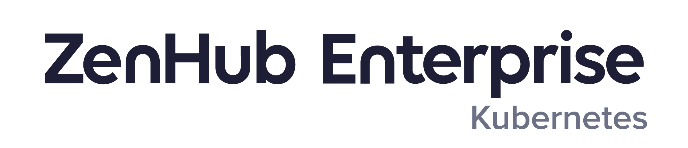

<div align="center">
  
</div>

[Website](https://www.zenhub.com/) • [On-Premise](https://www.zenhub.com/enterprise) • [Releases](https://www.zenhub.com/enterprise/releases/) • [Blog](https://blog.zenhub.com/) • [Chat (Community Support)](https://help.zenhub.com/support/solutions/articles/43000556746-zenhub-users-slack-community)

**Zenhub Enterprise On-Premise for Kubernetes** is the only self-hosted, Kubernetes-based team collaboration solution built for GitHub Enterprise Server. Plan roadmaps, use taskboards, and generate automated reports directly from your team’s work in GitHub. Always accurate.

## Table of Contents

- [1. Getting Started](#1-getting-started)
- [2. Requirements](#2-requirements)
  - [2.1 Systems Administration Skills](#21-systems-administration-skills)
  - [2.2 GitHub Enterprise Server](#22-github-enterprise-server)
  - [2.3 Kubernetes](#23-kubernetes)
  - [2.4 PostgreSQL](#24-postgresql)
  - [2.5 MongoDB](#25-mongodb)
  - [2.6 RabbitMQ](#26-rabbitmq)
  - [2.7 Redis](#27-redis)
  - [2.8 File and Image Storage](#28-file-and-image-storage)
  - [2.9 Zenhub Enterprise On-Premise License](#29-zenhub-enterprise-on-premise-license)
- [3. Configuration](#3-configuration)
  - [3.1 Docker Registry](#31-docker-registry)
    - [3.1.1 Using your private registry](#311-using-your-private-registry)
    - [3.1.2 Using Zenhub's public registry](#312-using-zenhubs-public-registry)
  - [3.2 Resource Scaling](#32-resource-scaling)
  - [3.3 Ingress](#33-ingress)
    - [3.3.1 TLS/SSL Backend](#331-tlsssl-backend)
  - [3.4 Database CA certificates](#34-database-ca-certificates)
  - [3.5 Buckets](#35-buckets)
  - [3.6 AWS DocumentDB as MongoDB](#36-aws-documentdb-as-mongodb)
  - [3.7 Configuring API Rate Limits](#37-configuring-api-rate-limits)
    - [3.7.1 GraphQL API](#371-graphql-api)
    - [3.7.2 Legacy REST API](#372-legacy-rest-api)
  - [3.8 PgBouncer](#38-pgbouncer)
- [4. Deployment](#4-deployment)
  - [4.1 Sanity Check](#41-sanity-check)
  - [4.2 Application Check](#42-application-check)
  - [4.3 Publish the Chrome and Firefox extensions](#43-publish-chrome-and-firefox-extensions)
- [5. Upgrades](#5-upgrades)
  - [5.1 Minor and Patch Versions](#51-minor-and-patch-versions)
    - [5.1.1 Infrastructure Upgrades](#511-infrastructure-upgrades)
    - [5.1.2 Application Updates](#512-application-updates)
- [6. Maintenance and Operational Tasks](#6-maintenance-and-operational-tasks)
  - [6.1 Publishing the Chrome and Firefox extensions](#61-publishing-the-chrome-and-firefox-extensions)
  - [6.2 Setting the first Zenhub Admin (License Governance)](#62-setting-the-first-zenhub-admin-license-governance)
  - [6.3 Maintenance Mode](#63-maintenance-mode)
  - [6.4 Support Bundle](#64-support-bundle)
  - [6.5 Usage Report](#65-usage-report)
- [7. Developer Site](#7-developer-site)
- [8. Platform Authentication](#8-platform-authentication)
  - [8.1 GitHub](#81-github)
  - [8.2 Microsoft Entra ID](#82-microsoft-entra-id)
  - [8.3 LDAP](#83-ldap)
  - [8.4 SAML](#84-saml)
- [9. Integrations](#9-integrations)
  - [9.1 Notion](#91-notion)
- [10. AI Features](#10-ai-features)
  - [10.1 Add a GPU Node Pool to your Kubernetes Cluster](#101-add-a-gpu-node-pool-to-your-kubernetes-cluster)
  - [10.2 Enable the AI Features in Zenhub](#102-enable-the-ai-features-in-zenhub)
  - [10.3 Verify the AI Setup is Complete](#103-verify-the-ai-setup-is-complete)

## 1. Getting Started

This README will be your guide to setting up Zenhub Enterprise (ZHE) in your Kubernetes cluster. If you do not currently run a Kubernetes cluster and still want to self-host Zenhub, please go back to the [**virtual-machine**](https://github.com/ZenhubHQ/zenhub-enterprise/tree/master/virtual-machine) folder. If this is your first time using Zenhub On-Premise, please get in touch with us at https://www.zenhub.com/enterprise and join us in our [Community](https://help.zenhub.com/support/solutions/articles/43000556746-zenhub-users-slack-community) so that we can provide you with additional support.

> As there are numerous steps to be followed and services to be deployed for Zenhub for Kubernetes, we have created a [deployment checklist](https://github.com/ZenhubHQ/zenhub-enterprise/blob/master/k8s-cluster/deployment-checklist.txt) in Markdown format that you can copy to a GitHub Issue to help you keep track of your progress.

Thank you for your interest in Zenhub!

## 2. Requirements

### 2.1 Systems Administration Skills

Systems administration skills are required for set-up. Those deploying Zenhub Enterprise for Kubernetes should be comfortable with:

- The basics of deploying and configuring cloud services, specifically those mentioned below
- Using `kubectl` to execute operations on a Kubernetes cluster
- Kubernetes ingress and SSL/TLS
- Container registry concepts

### 2.2 GitHub Enterprise Server

Zenhub Enterprise for Kubernetes requires a persistent connection to your own deployment of a recent version of [GitHub Enterprise Server](https://github.com/enterprise). You can find specific version compatibility information in the [release notes](https://github.com/zenhubhq/zenhub-enterprise/releases).

You will need to [set up an OAuth App](https://docs.github.com/en/developers/apps/creating-an-oauth-app) for Zenhub in your GitHub Enterprise Server. We recommend setting up the OAuth App under your primary GitHub Organization:

>**Application name**: Zenhub Enterprise
>
>**Homepage URL**: `https://<subdomain_suffix>.<domain_tld>`
>
>**Application description**:
>
>> Zenhub Enterprise is the only self-hosted, Kubernetes-based team collaboration solution built for GitHub Enterprise Server. Plan roadmaps, use taskboards, and generate automated reports directly from your team’s work in GitHub. Always accurate.
>
>**Authorization callback URL**: `https://<subdomain_suffix>.<domain_tld>/api/auth/github/callback`

### 2.3 Kubernetes

To get started with Zenhub, you must have an existing Kubernetes cluster set up. You should:

- Be using Kubernetes (>= 1.28).
- Have `kubectl` installed locally with credentials to access the cluster.
- Have [`kustomize`](https://kustomize.io/) installed locally (>= 4.5.7).
- Create a dedicated Kubernetes namespace. Grant your user full access to that namespace.
- Have the capability to pull Docker images from Zenhub's public Docker registry or have access to a private Docker registry where you can push images (and your cluster should have the ability to pull from that private registry).

### 2.4 PostgreSQL

Zenhub will require a connection to a PostgreSQL 15 database. We recommend the latest 15.x version. At the moment Zenhub supports up to PostgreSQL 15.x and does **not** support PostgreSQL 15.0 or greater.

> ⚠️ **NOTE:** We strongly recommend running this database outside the Kubernetes cluster via a database provider.

> ⚠️ **NOTE:** The user provided to Zenhub in the `postgres_url` connection string must be a `superuser` on the database. This is required to install Postgres extensions required for the Zenhub database architecture.

### 2.5 MongoDB

Zenhub will require a connection to a MongoDB database. We recommend using the latest 5.x version. It is also recommended to avoid any patch versions that MongoDB does not recommend for production use. Please refer to the list of versions to avoid here: https://www.mongodb.com/docs/manual/release-notes/5.0/#patch-releases.

> ⚠️ **NOTE:** We strongly recommend running this database outside the Kubernetes cluster via a database provider.

### 2.6 RabbitMQ

Zenhub will require a connection to RabbitMQ. We recommend the latest 3.x version.

### 2.7 Redis

Zenhub makes use of 1 externally managed Redis instance. This Redis instance is used by our `raptor-sidekiq-worker` service requires data persistence. We recommend the latest 7.x version.

> There are two additional Redis instances that will run inside the cluster via our configuration. You do not need to manage these.

### 2.8 File and Image Storage

Zenhub requires two S3-API compatible object storage buckets. One to store files (PDFs, Word documents, etc...) and another to store images and videos which are attached to issues through Zenhub's web app (files and images attached to issues using the Zenhub extension are stored by GitHub).

Resources required:

- 2 buckets
  - `files` bucket
  - `images` bucket
- IAM user `access_key_id`
- IAM user `access_key_secret`
- Bucket policy or permissions allowing bucket `list` and objects `get` from Kubernetes nodes

> ⚠️ **NOTE:** At the moment, only AWS S3 API is supported for buckets. S3-compatible APIs should also work.

To access and write these objects Zenhub also requires CLI/API credentials (`access_key_id`/`access_key_secret` or similar) for a IAM user with at least read and write access.

> ⚠️ **NOTE:** At the moment, only authentication via IAM credentials is supported. Support for role-based authentication is planned for a future release.

IAM credentials are used by Zenhub to write (`put`) objects and to create temporary pre-signed links.

To read (`get`) images and allow users to see uploaded images embedded in the issue page, the cluster nodes or network need to have proper access. Take a look at our [Terraform](https://github.com/ZenhubHQ/zenhub-enterprise/blob/master/terraform-aws-zhe-backend/buckets.tf) for an example bucket policy.


### 2.9 Zenhub Enterprise On-Premise License

Zenhub Enterprise On-Premise requires a license to run. This license is an encoded string that is entered as the `enterprise_license_token` secret in the main `kustomization.yaml` file. Please contact your Customer Success Manager to receive your token. For new customers, please visit https://www.zenhub.com/enterprise to get in touch with us.

## 3. Configuration

All configuration for Zenhub is done via `kustomize` configuration files. You will need to clone this repository and edit the configuration to match your deployment. The main file you will need to edit is the `k8s-cluster/kustomization.yaml` file.

Please review the comments therein as they describe the various sections that will require configuration. Areas that require your attention are marked with `[EDIT]` prefixes.

> ⚠️ **NOTE:** Once configured, this Kustomization file will contain various secrets and passwords (e.g. database credentials), so treat it as sensitive data.

You will have to store this file in order to run future infrastructure upgrades and application updates.

### 3.1 Docker Registry

Your K8s cluster will need access to the application container images to deploy Zenhub. Your cluster can either pull from your own private registry or from the public Zenhub registry.

#### 3.1.1 Using Your Private Registry

To use your own private registry, you will need to first get the images. Reach out to enterprise@zenhub.com (or for new customers, contact us [here](https://www.zenhub.com/enterprise)) to be granted a unique bundle download link from our team. Once you download the images, push them to your private registry.

Optionally, you can pull the images from our public registry and push them to your registry. To pull from our registry you will need a `dockerpassword` credential—reach out to our team to receive this.

The following example bash snippet can do it, as long as you are authenticated to your registry:

```bash
# Authenticate against our registry
docker login -u _json_key -p "$(cat dockerpassword | base64 --decode)" https://us.gcr.io

# Push, tag and pull Zenhub images into your registry
your_registry=<your_own_registry_without_trailing_slash>
tag=zhe-<version>
images="kraken-webapp toad-backend raptor-backend kraken-extension devsite kraken-zhe-admin sanitycheck"
for i in $(echo $images); do docker pull us.gcr.io/zenhub-public/${i}:${tag} && docker tag us.gcr.io/zenhub-public/${i}:master ${your_registry}/${i}:${tag} && docker push ${your_registry}/${i}:${tag}; done
```

Finally you need to edit your `kustomization.yaml` file to configure all the deployments to use your registry. To do this, change the following (where `your_own_registry` is the hostname of your private registry):

```yaml
images:
  - name: kraken-webapp
    newName: <your_own_registry>/kraken-webapp
    newTag: zhe-<version>
  - name: kraken-extension
    newName: <your_own_registry>/kraken-extension
    newTag: zhe-<version>
  - name: kraken-zhe-admin
    newName: <your_own_registry>/kraken-zhe-admin
    newTag: zhe-<version>
  - name: raptor-backend
    newName: <your_own_registry>/raptor-backend
    newTag: zhe-<version>
  - name: toad-backend
    newName: <your_own_registry>/toad-backend
    newTag: zhe-<version>
  - name: sanitycheck
    newName: <your_own_registry>/sanitycheck
    newTag: zhe-<version>
  - name: devsite
    newName: <your_own_registry>/devsite
    newTag: zhe-<version>
  - name: busybox
    newName: docker.io/library/busybox
    newTag: latest
  - name: nginx
    newName: docker.io/library/nginx
    newTag: latest
```

#### 3.1.2 Using Zenhub's public registry

If your cluster is allowed to pull docker images from our public registry located at: `us.gcr.io/zenhub-public`, you can use this method.

To pull images you will need to authenticate.

- A `dockerpassword` file that contains a base64 encoded password is needed, reach out to enterprise@zenhub.com.
- You will need to generate a `kubernetes.io/dockerconfigjson` secret with the following command (where `<namespace>` is the name of the Kubernetes namespace you will be deploying to):

  ```bash
  kubectl -n <namespace> create secret docker-registry zenhub-docker-registry-credentials \
  --docker-server=https://us.gcr.io \
  --docker-username=_json_key \
  --docker-email=docker@zenhub.io \
  --docker-password="$(cat dockerpassword | base64 --decode)"
  ```

The secret `zenhub-docker-registry-credentials` created by running the above command is required for Zenhub deployments.

Finally, uncomment the following lines in your `kustomization.yaml`:

```yaml
# patchesStrategicMerge:
  # - options/zenhub-registry/zenhub-registry.yaml
```

### 3.2 Resource Scaling

The default configuration ships with the minimum resources applied for all Kubernetes components. If your Zenhub instance will be handling a large amount of traffic, you will want to modify the resources accordingly. Most of the deployments have autoscaling based on CPU usage, but you might want to scale a deployment to a specific value. Here is how to do this using `kustomize`:

1. Edit the file `options/scaling/deployments-scaling.yaml` with the desired number of replicas.

2. Uncomment the following lines in your `kustomization.yaml`:

```yaml
# patchesStrategicMerge:
  # - options/scaling/deployments-scaling.yaml
```

Let's say you want to allow `raptor-api` to scale up to 30 replicas:

`options/scaling/deployments-scaling.yaml`:

```yaml
---
# raptor-api
apiVersion: autoscaling/v2
kind: HorizontalPodAutoscaler
metadata:
  name: raptor-api
spec:
  minReplicas: 5
  maxReplicas: 30
```

Or, you can modify the number of Sidekiq workers to allow for more parallel data processing:

`options/scaling/deployments-scaling.yaml`:

```yaml
---
# raptor-sidekiq-worker
apiVersion: apps/v1
kind: Deployment
metadata:
  name: raptor-sidekiq-worker
spec:
  replicas: 10
```

### 3.3 Ingress

We highly recommend the use of NGINX Ingress Controller in your cluster. We provide an example configuration for an AWS EKS cluster in [k8s-cluster/options/ingress/](https://github.com/ZenhubHQ/zenhub-enterprise/tree/master/k8s-cluster/options/ingress), but this will likely need tweaks for your specific environment.

The main requirement from the application side is:

- Your Ingress targets the `nginx-gateway` service on port 80 or 443 for the main app
- `admin-ui` service on port 80 or 443 for the Administration Panel
- `devsite` service on port 80 or 443 for the GraphiQL Explorer

There is a secondary requirement for mid-size and larger environments where the `toad-websocket` pod will need to run more than 1 replica. In this situation, cookie-based sticky sessions must be enabled, and a server snippet must be used for a path rewrite. We have found that NGINX Ingress supports this, hence our recommendation.

The provided manifests expose Zenhub behind a single ClusterIP service, listening on ports 80 and 443. You will need to set up and configure HTTPS through your Ingress (public-facing SSL configuration is not within the scope of "Zenhub for Kubernetes").

An example of the ClusterIP definition:

```yaml
apiVersion: v1
kind: Service
metadata:
  name: nginx-gateway
spec:
  type: ClusterIP
  ports:
    - name: https
      port: 443
      targetPort: 443
    - name: http
      Port: 80
      targetPort: 80
```

An example of the Ingress definition:

```yaml
apiVersion: networking.k8s.io/v1
kind: Ingress
metadata:
  name: ingress-zhe
spec:
  rules:
    - host: "zenhub.yourcompany.com"
      http:
        paths:
          - pathType: Prefix
            path: /
            backend:
              service:
                name: nginx-gateway
                port:
                  number: 443
    - host: "admin-zenhub.yourcompany.com"
      http:
        paths:
          - pathType: Prefix
            path: /
            backend:
              service:
                name: admin-ui
                port:
                  number: 443
     - host: "developers-zenhub.yourcompany.com"
      http:
        paths:
          - pathType: Prefix
            path: /
            backend:
              service:
                name: devsite
                port:
                  number: 443
```

> ⚠️ **NOTE:** These examples don't make any assumptions about your cluster. They might not work exactly as shown as they could be missing some annotations to interoperate with your existing Ingress definition.

> ⚠️ **NOTE:** Public Facing TLS is not taken into account here, depending on what is installed on your cluster, it could also be handled by the Ingress.

> ⚠️ **NOTE:** If you are using SAML SSO or LDAP for your GitHub Enterprise Server, ensure the top and second level domain used by Zenhub are identical to that used by GitHub. This will help ensure that Zenhub can retrieve public assets (like user avatars) from GitHub.

#### 3.3.1 TLS/SSL Backend

The connection from the load balancer/ingress to Zenhub uses HTTP by default, but the entry points, `nginx-gateway` (Zenhub's main app), `admin-ui` (Zenhub's administration app), and `devsite` (Zenhub's GraphiQL explorer) can be accessed on both port `80` and `443`.

To use the encrypted connection to these backends, your ingress manager needs to support the HTTPS backend protocol. Each ingress controller might have different ways to configure this feature.

> ⚠️ **NOTE:** It is very important to configure the application backend port based on the cluster ingress functionality.

Examples:

##### Nginx-Ingress

```yaml
kind: Ingress
metadata:
  annotations:
    nginx.ingress.kubernetes.io/backend-protocol: "HTTPS"
```

[Documentation](https://kubernetes.github.io/ingress-nginx/user-guide/nginx-configuration/annotations/#backend-protocol)

##### Google GKE

```yaml
kind: Service
metadata:
  annotations:
    cloud.google.com/app-protocols: '{"my-https-port":"HTTPS","my-http-port":"HTTP"}'
```

[Documentation](https://cloud.google.com/kubernetes-engine/docs/concepts/ingress-xlb#https_tls_between_load_balancer_and_your_application)

##### Traefik V2.0

```yaml
- "traefik.http.services.service0.loadbalancer.server.scheme=https"
```

[Documentation](https://doc.traefik.io/traefik/routing/providers/docker/#services)


### 3.4 Database CA certificates

#### Postgres

TLS connection with Postgres utilizes the `secretGenerator` near the end of the [kustomization.yaml](kustomization.yaml)

> The files can be stored anywhere and referenced in the configuration by entering a full path name.

```yaml
- name: postgres-ca-bundle
  behavior: replace
  files:
    - <some_path>/<some_pem>
```

#### MongoDB

TLS connection with Postgres utilizes the `secretGenerator` near the end of the [kustomization.yaml](kustomization.yaml)

> The files can be stored anywhere and referenced in the configuration by entering a full path name.

```yaml
- name: mongo-ca-bundle
  behavior: replace
  files:
    - <some_path>/<some_pem>
```

### 3.5 Buckets

To configure Zenhub to store uploaded images and files as objects in buckets, the following variables need to be provided in `kustomization`.yaml`

```yaml
configMap:
  - bucket_access_key_id=<access_key_id>
  - bucket_region=<bucket_region>
  - bucket_domain=<bucket_public_domain>
  - files_bucket_name=<bucket_name>
  - images_bucket_name=<bucket_name>
secret:
  - bucket_secret_access_key=<some-key>
```

IAM credentials are used by Zenhub to write (`put`) objects and to create temporary pre-signed links.

To read (`get`) images and allow users to see uploaded images embedded in issues, the cluster nodes or network needs to have proper access. This access can be provided in several different ways:

- Bucket policy/permissions allowing bucket `list` and objects `get` to K8s cluster VPC
- Bucket policy/permissions allowing bucket `list` and objects `get` to K8s cluster VPC S3 Endpoint
- Bucket policy/permissions allowing bucket `list` and objects `get` to K8s nodes role

### 3.6 AWS DocumentDB as MongoDB

To utilize AWS DocumentDB as MongoDB:

- Enable the line in the configMapGenerator:

```yaml
# AWS DocumentDB as MongoDB
# - mongo_is_documentdb=true
```

- TLS will need to be disabled in the DocumentDB parameter group.

> ⚠️ **NOTE:** We are investigating a solution to utilize TLS connections.

### 3.7 Configuring API Rate Limits

#### 3.7.1 GraphQL API

Starting in ZHE v3.5, a new public GraphQL API is available for you to interact with Zenhub programmatically. There are two configurable settings for the GraphQL API:

- [graphql_active_operation_limit](https://developers.zenhub.com/graphql-api-docs/rate-limiting/index.html#concurrent-requests-limit) (default: 30 concurrent requests)
- [graphql_runtime_limit_ms](https://developers.zenhub.com/graphql-api-docs/rate-limiting/index.html#processing-time-limits) (default: 90 seconds per minute)

To configure the GraphQL rate limits, follow these steps:

1. Edit the kustomization file `k8s-cluster/kustomization.yaml`

    a. In the _configMapGenerator_ section for the _configuration_ configMap, set your desired values for `graphql_active_operation_limit` and/or `graphql_runtime_limit_ms`

    b. Save your changes to the file

2. Apply the changes 

```bash
kustomize build . | kubectl apply -f-
```

3. Restart the raptor-api deployment so the updated rate limit configmap values are picked up

```bash
kubectl rollout restart deployment raptor-api -n <namespace>
```

#### 3.7.2 Legacy REST API

There are two configurable settings for the Legacy REST API:

- `rest_api_request_limit` (default: 100 requests)
- `rest_api_time_limit` (default: 60 seconds)

This means by default the API will only respond to a maximum of 100 requests within a 60-second window.

To configure the REST API rate limits, follow these steps:

1. Edit the kustomization file `k8s-cluster/kustomization.yaml`

    a. In the _configMapGenerator_ section for the _configuration_ configMap, set your desired values for `rest_api_request_limit` and/or `rest_api_time_limit`

    b. Save your changes to the file

2. Apply the changes

```bash
kustomize build . | kubectl apply -f-
```

3. Restart the toad-api deployment so the updated rate limit configmap values are picked up

```bash
kubectl rollout restart deployment toad-api -n <namespace>
```

### 3.8 PgBouncer

PgBouncer, the lightweight connection pooler for PostgreSQL, is enabled by default in Zenhub Enterprise v3.5.0 and later.

If your Postgres database is relatively large and the [default PgBouncer configuration](https://www.pgbouncer.org/config.html) is not sufficient, you can customize the PgBouncer configuration by following the PgBouncer configuration section in the main [kustomization.yaml](kustomization.yaml). For example, if your database has a connection limit set to something well above 100, you may want to increase the PgBouncer client connection limit and pool size to suit. Reach out to Zenhub Enterprise Support if you need advice on PgBouncer configuration settings for your database size.

## 4. Deployment

Once you have set up all the configurations in your copy of `kustomization.yaml` and are ready to deploy to your cluster, you must run the `configmap-generator.sh` script that will fill placeholders in our Kubernetes manifests with your configuration values.

To run the script, navigate to the root of the directory containing your `kustomization.yaml` file, which also contains the `configmap-generator.sh` script. Then, run the script with these two commands:

```bash
chmod 700 configmap-generator.sh
./configmap-generator.sh
```

**If you have deployed Zenhub previously**, you may review the diff via:

> ⚠️ **NOTE:** Run these commands from the directory that contains your `kustomization.yaml` file.

```bash
kustomize build . | kubectl diff -f-
```

If the output looks correct, you can deploy the cluster via:

```bash
kustomize build . | kubectl apply -f-
```

### 4.1 Sanity Check

We have included a `sanitycheck` utility which scans the cluster and helps diagnose common problems that can occur when deploying a large number of services.

To review the results of the check, view the logs of the `sanitycheck` Kubernetes Job:

```bash
kubectl logs <sanitycheck-pod-name>
```

The sanity check will:

- Ensure a connection can be established to MongoDB, PostgreSQL, RabbitMQ and Redis.
  - Hostname resolves
  - Port is open
  - Credentials exist to open database/cache connection
- Ensure a connection can be established to the GitHub Enterprise server.
  - Hostname resolves
  - Port is open
- Ensure a connection can be established to the file storage.
  * Hostname resolves
  * PutObject, GetObject and ListBucket operations perform without error
- Ensure you have a valid `enterprise_license_token`

The `sanitycheck` script will execute every 10 seconds until all the checks have passed. If the Job status is "Complete", all the checks were successful.

Optionally, you can disable the creation of this Job by commenting out the resource in your `kustomization.yaml` like this:

```bash
resources:
  # - options/sanitycheck
```

### 4.2 Application Check

To verify that your deployment was successful, you should be able to visit the Zenhub application, log into the web app, load/create a Workspace, and see a board with issues.

Additionally, a good test is to open Zenhub in two separate browser tabs. In tab #1, move an issue on the board from one pipeline to another. Check tab #2 to verify that the issue moved.

### 4.3 Publish Chrome and Firefox Extensions

See section [6.1](#61-publishing-the-chrome-and-firefox-extensions) for instructions to publish the extensions.

## 5. Upgrades

> ⚠️ **NOTE:** Please see our [Release Notes](https://github.com/ZenhubHQ/zenhub-enterprise/releases) for detailed extra steps or concerns for a given release version.

### 5.1 Minor and Patch Versions

Two types of upgrades will have to be conducted:

1. Occasional infrastructure upgrades
2. Frequent application updates

#### 5.1.1 Infrastructure Upgrades

Infrastructure upgrades are related to the Kubernetes resources themselves.

From time to time, we will release a new version of Zenhub Enterprise infrastructure via a GitHub Release on the [ZenhubHQ/zenhub-enterprise](https://github.com/ZenhubHQ/zenhub-enterprise)
repository. Most releases will not require downtime.

> This doesn't update the application code. See below for [application updates](#512-application-updates).

##### 1. Prepare

* You need to get the `kustomization.yaml` you configured with all the secrets to take into account
* Perform a diff to make sure no outstanding changes are waiting to be applied

```bash
kustomize build . | kubectl diff -f-
```

> It should exit 0 and only display a warning of unused variables

* Make a copy of your existing `kustomization.yaml` and keep it handy for the next step

##### 2. Update `kustomization.yaml`

* Check out the `zenhub-enterprise` repo at the tag of the target release
* Populate the new `kustomization.yaml` with your existing configuration values, adding any new required values for the new version.

##### 3. Diff and apply

* First, delete the `raptor-db-migrate` and `sanitycheck` jobs so they may be recreated without errors:

> Make sure the status of the jobs are `Complete` and not `Running`

```bash
kubectl -n <your_dedicated_namespace> delete job/raptor-db-migrate job/sanitycheck
```

- Then perform a diff to check what the upgrade will do

```bash
kustomize build . | kubectl diff -f-
```

> Unless said otherwise in the infrastructure upgrade release notes, all infrastructure upgrades can be applied safely without downtime

- If everything looks correct, you can deploy the cluster via:

```bash
kustomize build . | kubectl apply -f-
```

##### 3. Finalize

* Securely store the updated `kustomization.yaml`

#### 5.1.2 Application Updates

Application updates are related to the Zenhub application code — the containers Zenhub is running on.

Quite often, we will release a new version of the Zenhub Enterprise application in the form of new Docker tags to pull from our public Docker Registry.

An application update doesn't require any downtime.

##### 1. Prepare

* Open your `kustomization.yaml` file that you configured when deploying Zenhub.
* Perform a diff to make sure no outstanding changes are waiting to be applied:

```bash
kustomize build . | kubectl diff -f-
```

> It should exit 0 and only display a warning of unused variables.

##### 2. Update `kustomization.yaml`

* To perform an application update to any Zenhub version, modify the image tags in the `images` section to match the new Zenhub application image tags.

> If you are using your own registry, you have to sync the images first, see [3.1 Docker Registry](#31-docker-registry)

```txt
images:
  - name: kraken-webapp
    newName: us.gcr.io/zenhub-public/kraken-webapp
    newTag: zhe-<version>
  - name: kraken-extension
    newName: us.gcr.io/zenhub-public/kraken-extension
    newTag: zhe-<version>
  - name: kraken-zhe-admin
    newName: us.gcr.io/zenhub-public/kraken-zhe-admin
    newTag: zhe-<version>
  - name: raptor-backend
    newName: us.gcr.io/zenhub-public/raptor-backend
    newTag: zhe-<version>
  - name: toad-backend
    newName: us.gcr.io/zenhub-public/toad-backend
    newTag: zhe-<version>
  - name: sanitycheck
    newName: us.gcr.io/zenhub-public/sanitycheck
    newTag: <version>
  - name: devsite
    newName: us.gcr.io/zenhub-public/devsite
    newTag: <version>
```

* Next, modify the version to match the `<version>` of the release. Example:

```txt
commonAnnotations:
  app.kubernetes.io/version: 3.5.4
```

* Save the file and continue to the next step of the upgrade below.

##### 3. Diff and apply

* First delete the `raptor-db-migrate` and `sanitycheck` jobs so they may be recreated without errors:

> Make sure the status is `Complete` and not `Running`

```bash
kubectl -n <your_dedicated_namespace> delete job/raptor-db-migrate delete job/sanitycheck
```

* Then perform a diff to check what the upgrade will do:

```bash
kustomize build . | kubectl diff -f-
```

> All application updates can be applied safely without downtime

* If everything looks correct, you can deploy the cluster:

```bash
kustomize build . | kubectl apply -f-
```

##### 3. Finalize

- Securely store the updated `kustomization.yaml`

##### 4. Update the Chrome and Firefox extensions

While application updates will be immediately applied to the Zenhub web app, an update needs to be published in order for the Chrome and Firefox extensions to be updated for your users. See section [6.1](#61-publishing-the-chrome-and-firefox-extensions) for more information.

## 6. Maintenance and Operational Tasks

### 6.1 Publishing the Chrome and Firefox extensions

There are two methods to interact with the Zenhub UI:

- The Zenhub web app
- The Zenhub browser extensions for Chrome and Firefox, which allow users access to the power of Zenhub from within the UI of GitHub Enterprise

To use the extensions with GitHub Enterprise, you must publish your own versions of them. The first time you publish the extensions, you will need to set up a Chrome Developer account and a Mozilla Developer account before creating a new extension in each platform. When application updates are applied, you will publish updates to the _existing_ extension on each platform.

For detailed instructions, please visit the Zenhub Enterprise Admin UI (`https://<admin_ui_subdomain>`.`<domain_tld>`).

> ⚠️ **NOTE:** After the Chrome extension is published, you will need to get the URL of the published extension and put it into your configuration file as `CHROME_EXTENSION_WEBSTORE_URL`. With this value entered, re-run your configuration. This will ensure the link to download the Chrome extension on the application landing page is active.

### 6.2 Setting the first Zenhub Admin (License Governance)

Zenhub provides a method of license governance that is enforced across the entire set of GitHub Enterprise users. By default, any user of the connected GitHub Enterprise Server can access, install, and use Zenhub Enterprise On-Premise. If you would like to control access to Zenhub, you will need to promote one or more users to be Zenhub Admins.

Zenhub Admins can be created from the Admin UI (`https://<admin_ui_subdomain>`.`<domain_tld>/settings`). This mechanism exists to ensure only a privileged user can create the first Zenhub Admin. Existing Zenhub Admins can also promote existing Zenhub users to Admin from within the Zenhub web app.

For more information on License Governance, please view [this article](https://help.zenhub.com/support/solutions/articles/43000559760-license-governance-in-zenhub-enterprise) in our Help Center.

### 6.3 Maintenance Mode

When operating a ZHE deployment on Kubernetes, you may face situations in which you would like to prevent users from accessing the application (such as restoring a database backup). For this purpose, we have included a **maintenance mode** in the `nginx-gateway` pod.

Maintenance mode can be enabled in two ways:

1. _Automatically_, when Zenhub detects that GitHub is in maintenance mode. Zenhub checks GitHub for this status every 30 seconds.
2. _Manually_, when a system administrator determines it is necessary to gracefully block user access to the application.

Enable maintenance mode:

```bash
kubectl -n <namespace> set env deployment nginx-gateway -c monitor MAINTENANCE_MODE="TRUE"
```

Disable maintenance mode:

```bash
kubectl -n <namespace> set env deployment nginx-gateway -c monitor MAINTENANCE_MODE=""
```

### 6.4 Support Bundle

To help our support team troubleshoot issues you might have, a support bundle including logs and configuration can be generated and uploaded to our secure S3 bucket. Please follow the documentation in [./support-bundle/README.md](./support-bundle/README.md) for details.

### 6.5 Usage Report

Since Zenhub Enterprise On-Premise is a completely self-contained system in your environment, we require a monthly usage report to be sent to us in order to ensure your Zenhub usage aligns with your billing. The usage report can be found in the Admin UI at `https://<admin_ui_subdomain>.<domain_tld>/usage` and sent to enterprise@zenhub.com.

## 7. Developer Site

Zenhub Enterprise for K8s comes with a static developer site that contains documentation for the GraphQL API that is available to developers who want to automate aspects of using Zenhub.

Once you have configured and deployed Zenhub, the developer site is made available at `https://<graphiql_explorer_subdomain_prefix>-<subdomain_suffix>.<domain_tld>`, via ports `80` and `443`.

_An example of what the developer site looks like and does can be found at: <https://developers.zenhub.com>_

## 8. Platform Authentication

To better support non-technical team members, Zenhub provides a range of authentication options other than connecting through GitHub. This allows team members without a GitHub account to sign up and use Zenhub, saving your organization money on unnecessary GitHub licenses.

These authentication options can be enabled/disabled depending on your organization's needs. You can enable none, one, or multiple authentication options.

Users who sign up using these authentication methods that do not connect their GitHub account cannot view or modify any GitHub issues by default, they are only able to view and use Zenhub Issues. The admins of a GitHub repository can make their repository's issues visible to non GitHub-connected Zenhub users in their Zenhub Workspace settings.

These users can choose to connect their GitHub account at any time which will provide them with full Zenhub functionality. Existing users can also disconnect their GitHub account if they only want to use the Zenhub platform and don't require a GitHub license.

Of the authentication methods listed below, the only one that is enabled by default is GitHub.

> ⚠️ **NOTE:** Users may need to clear their browser cache in order to see the newly enabled authentication options on the login page once they have been applied.

### 8.1 GitHub

- This classic authentication option allows users to sign in via their GitHub account
- This is the default authentication method for Zenhub and cannot be disabled

### 8.2 Microsoft Entra ID

- This authentication option allows users to sign in through Microsoft Entra ID
- An Microsoft Entra ID tenant is required to use this form of authentication
- It can be enabled by following instructions for `entra_id_enabled` in the main `kustomization.yaml`

To configure your Microsoft Entra ID Application for Zenhub, you will need to do the following:

#### Add a New Application via Microsoft Entra ID

Start by going to the Entra ID portal in Microsoft Azure. The URL for this will be `https://portal.azure.com/#view/Microsoft_AAD_IAM/ActiveDirectoryMenuBlade/~/Overview`. Then, follow the steps below:

- Navigate to **Overview** and click `+ Add` > `Enterprise application`
  - Name your application and select the `Integrate any other application you don't find in the gallery (Non-gallery)` option. Then click `Create`.

#### Configure the Application

- Under **Authentication > Platform configurations**, click `Add a platform` and select `Web`.
  - Set the Redirect URI to `https://<subdomain_suffix>.<domain_tld>/api/zenhub_users/auth/azure_activedirectory_v2/callback`. Then click `Configure`.
- Under **Authentication > Front-channel logout URL**, set the URL to `https://<subdomain_suffix>.<domain_tld>/logout`. Then click `Save`.
- Under **Certificates & secrets**, click `+ New client secret`, set a description, and set the expiration to whatever you prefer. Then click `Add`.
- Under **API permissions > Configured permissions**, click `Add a permission` and select `Microsoft Graph`.
  - Select `Delegated permissions` and check the `User.Read` permission. Then click `Add permissions`.

#### Obtain configuration values

There are three values that need to be obtained from your Microsoft Entra ID Application to enable Microsoft Entra ID authentication via your kustomization.yaml file:

- `entra_id_client_id`
- `entra_id_client_secret`
- `entra_id_tenant_id`

To obtain `entra_id_client_id` and `entra_id_tenant_id`, go to **App registrations > All applications > Your application > Overview**

- The value for `entra_id_client_id` will be the value for `Application (client) ID` found on the page.
- The value for `entra_id_tenant_id` will be the value for `Directory (tenant) ID` found on the page.

To obtain `entra_id_client_secret`, go to **App registrations > All applications > Your application > Certificates & secrets**

- The value for `entra_id_client_secret` will be the value for `Value` found on the page. Click the copy button to copy the value to your clipboard.

> ⚠️ **NOTE:** The login option will say Azure AD instead of Microsoft Entra ID since that name change was recent and not yet reflected in the Zenhub UI.

### 8.3 LDAP

- This authentication option allows users to sign in using LDAP
- An existing LDAP server is required to use this form of authentication
- It can be enabled by following instructions for `ldap_enabled` in the main `kustomization.yaml`

  Ensure that there is an LDAP Bind DN user in your directory being connected that has read access to the LDAP directory. This user will be used to search for the users attempting to sign in.

### 8.4 SAML

- This authentication option allows users to sign in using SAML
- An SSO with SAML provider is required to use this form of authentication
- It can be enabled by following instructions for `saml_enabled` in the main `kustomization.yaml`

  To configure your SSO with SAML Application for Zenhub, you will need to set the following values in SAML SSO Application:

  - **Application ACS URL**: `https://<subdomain_suffix>.<domain_tld>/api/zenhub_users/auth/saml/callback`
  - **SAMLSubject NameID**: `email`
  - **SAMLSubject NameID Format**: `urn:oasis:names:tc:SAML:1.1:nameid-format:emailAddress`
  - **Attributes**:
    Service Provider Attribute Name mappings for the following attributes:
    - **Email**: `email`
    - **Name**: `name`

## 9. Integrations

### 9.1 Notion

Zenhub Enterprise for K8s can be integrated with Notion to allow users to preview Notion links within Zenhub Issues. This integration is disabled by default and can be enabled by following instructions for `notion` in the main `kustomization.yaml`.

To create the Notion integration, you will need to do the following:

1. Navigate to <https://www.notion.com/my-integrations> and click `+ New integration`

2. Enter "Basic Information" for your integration
    - Choose an associated workspace that you use for your organization. This is only temporary and will be changed later when the integration is upgraded to use OAuth later.
    - Name your integration whatever you prefer
    - You can download the Zenhub logo from <https://github.com/ZenHubHQ/zenhub-enterprise/blob/master/assets/notion-integration/zenhub-logo.png> and upload it as your integration's logo.

3. After creating the integration, you should be able to navigate to the "Capabilities" section for that integration via the sidebar. Set enabled the following capabilities:
    - Read content
    - Update content
    - Insert content
    - Read user information including email addresses

    Click `Save changes`

4. Navigate to the "Distribution" tab in the sidebar and toggle on the `Do you want to make this integration public?` option. This will allow you to share the integration with your organization. Then fill out the following information:

- Organization Information

  - **Company name**: `<your company name>`
  - **Website or homepage**: `https://www.zenhub.com/`
  - **Privacy policy**: `https://www.zenhub.com/privacy-policy`
  - **Terms of use**: `https://www.zenhub.com/terms-of-service`
  - **Support email**: `support@zenhub.com`

- OAuth Domain & URIs
  
  - **Redirect URI**: `https://<subdomain_suffix>.<domain_tld>/api/zenhub_users/auth/notion/callback`

  Click `Submit`

5. After submitting the integration, you should be able to navigate to the "Secrets" tab in the sidebar. Copy the `OAuth client ID` and `OAuth client secret` values and set them in your `kustomization.yaml` file for `notion_client_id` and `notion_client_secret` respectively.

## 10. AI Features

Zenhub Enterprise v4.2 and greater has AI driven features that can be enabled to help save time and improve productivity. These features are powered by a large language model (LLM) that is securely hosted within your Kubernetes cluster alongside Zenhub. The AI features are disabled by default. To enable them, there are several steps that need to be taken to ensure that the LLM can be set up and run correctly.

### 10.1 Add a GPU Node Pool to your Kubernetes Cluster

The AI features require a GPU to run the LLM. You will need to add a GPU node pool to your Kubernetes cluster. The GPU node pool should have at least one node with a GPU that has at least 24GB of VRAM. The node should have at least 4 CPUs and 16GB of memory to run the LLM deployment.

The NVIDIA device plugin will need to be installed on the GPU node in order to run the LLM. The plugin is a DaemonSet that runs on each GPU node in the cluster and exposes the GPU resources to the Kubernetes API. The NVIDIA device plugin can be installed by applying the following manifest. This manifest is for the NVIDIA device plugin version 0.15.0. You can find the latest version of the NVIDIA device plugin on the NVIDIA GPU Cloud (NGC) registry. The NVIDIA device plugin should be installed in the `kube-system` namespace. You will need to update the `nodeSelector` and `tolerations` to match the GPU node(s) in your cluster.

```yaml
apiVersion: apps/v1
kind: DaemonSet
metadata:
  name: nvidia-device-plugin-daemonset
  namespace: kube-system
spec:
  selector:
    matchLabels:
      name: nvidia-device-plugin-ds
  updateStrategy:
    type: RollingUpdate
  template:
    metadata:
      labels:
        name: nvidia-device-plugin-ds
    spec:
      nodeSelector:
        node.kubernetes.io/instance-type: g5.example
      tolerations:
      - key: ai-workloads-only-example
        operator: Exists
        effect: NoSchedule
      priorityClassName: "system-node-critical"
      containers:
      - image: nvcr.io/nvidia/k8s-device-plugin:v0.15.0
        name: nvidia-device-plugin-ctr
        env:
          - name: FAIL_ON_INIT_ERROR
            value: "false"
        securityContext:
          allowPrivilegeEscalation: false
          capabilities:
            drop: ["ALL"]
        volumeMounts:
        - name: device-plugin
          mountPath: /var/lib/kubelet/device-plugins
      volumes:
      - name: device-plugin
        hostPath:
          path: /var/lib/kubelet/device-plugins
```

Once the DaemonSet is applied, you can check that the NVIDIA device plugin is running on the GPU node(s) by running the following command:

```bash
kubectl get pods -n kube-system -l name=nvidia-device-plugin-ds
```

To confirm it is working correctly, you can run the following command:

```bash
kubectl describe node <gpu-node-name> | grep nvidia.com/gpu
```

The output should show the number of GPUs on the node that are available for scheduling.

### 10.2 Enable the AI Features in Zenhub

To enable the AI features in Zenhub, you will need to set `ai_features_enabled` in the main `kustomization.yaml` file to `true`.

You will also need to uncomment the `options/ai-features/gpu-nodepool-tolerations-and-replicas.yaml` file in the `patchesStrategicMerge` section, and edit the file accordingly with the correct tolerations and replicas for your GPU nodepool.

Then, apply the changes to your cluster via the typical `diff` and `apply` commands outlined in the [Deployment](#4-deployment) section.

### 10.3 Verify the AI Setup is Complete

Once you have completed the steps above, you can verify that the AI setup is complete by checking that the AI features are working within the Zenhub application. You can do this by creating a new issue within Zenhub and checking if there is a "Generate acceptance criteria" button available under the description field when creating the issue. Click the button to generate acceptance criteria for the issue. If the button is available, and you are able to generate acceptance criteria, the AI setup is complete. If you are unable to generate acceptance criteria, please [contact our team](mailto:enterprise@zenhub.com), and we will be happy to assist you!
