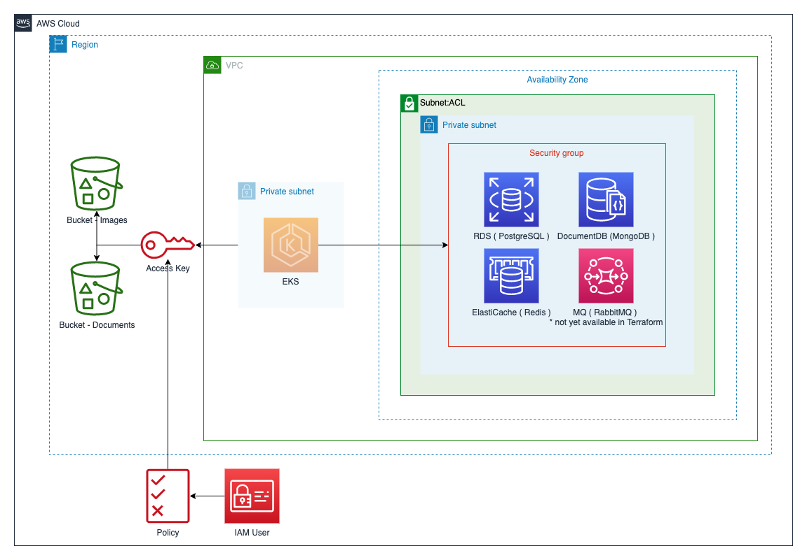

# terraform-aws-zhe-data

[<div align="center">
  ][zenhub]
</div>

Terraform module to provision ZHE backend resources in an existing [`VPC`](https://aws.amazon.com/vpc)

Resources cretead:

* [Private Subnets](http://docs.aws.amazon.com/AmazonVPC/latest/UserGuide/VPC_Subnets.html)
* [Security Group](https://docs.aws.amazon.com/vpc/latest/userguide/VPC_SecurityGroups.html)
* [Network ACL](https://docs.aws.amazon.com/vpc/latest/userguide/vpc-network-acls.html)
* [S3 Buckets](https://docs.aws.amazon.com/AmazonS3/latest/user-guide/what-is-s3.html)
* [RDS - PostgreSQL](https://docs.aws.amazon.com/AmazonRDS/latest/UserGuide/Overview.DBInstance.html)
* [ElastiCache - Redis](https://docs.aws.amazon.com/AmazonElastiCache/latest/red-ug/WhatIs.html)
* [DocumentDB](https://docs.aws.amazon.com/documentdb/latest/developerguide/what-is.html)
* [IAM user](https://docs.aws.amazon.com/IAM/latest/UserGuide/introduction_identity-management.html#intro-identity-users)
* [IAM Policies](https://docs.aws.amazon.com/IAM/latest/UserGuide/introduction_access-management.html)
* [MQ - RabbitMQ](https://docs.aws.amazon.com/amazon-mq/latest/developer-guide/getting-started-rabbitmq.html) \* Future Feature - NOT YET IN TERRAFORM

__Note:__ this module is intended for use with [ZenHub Enterprise][zenhub_enterpsise] Kubernetes in an existing VPC.

<div align="center">
  
</div>

## Table of Contents

1. [Usage](#Usage)
2. [Subnet calculation logic](#subnet-calculation-logic)
3. [Requirements](#Requirements)
4. [Providers](#Providers)
5. [Inputs](#Inputs)
6. [Outputs](#Outputs)
7. [Authors](#authors)

---

## Usage

```hcl
module "zhe" {
  source              = "source = "github.com/zenhubHQ/zenhub-enterprise/terraform-aws-zhe-backend"
  env    = "test"
  region = "us-west-2"
  vpc_id = "vpc-0000aaaa11b2cc111"

  postgres_vars = {
    instance_class = "db.t3.small"
  }

  redis_vars = {
    node_type = "cache.t3.small"
  }

  documentdb_vars = {
    instance_class = "db.t3.medium"
    instance_count = "1"
  }
}
```

---

## Subnet calculation logic

`terraform-aws-zhe-data` creates a set of subnets based on `var.cidr_netnum`, the existing `VPC CIDR` and number of Availability Zones in the region.

For subnet set calculation, the module uses Terraform interpolation [cidrsubnet](https://www.terraform.io/docs/configuration/functions/cidrsubnet.html).

`cidrsubnet(iprange, newbits, netnum) - Takes an IP address range in CIDR notation (like 10.0.0.0/16) and extends its prefix to include an additional subnet number. For example, cidrsubnet("10.0.0.0/16", 8, 100) returns 10.0.100.0/24 and ("10.0.0.0/16", 8, 101) returns 10.0.101.0/24;`

`newbits` is the number of additional bits with which to extend the prefix. For example, if given a prefix ending in /16 and a newbits value of 4, the resulting subnet address will have length /20.

`netnum` is a whole number that can be represented as a binary integer with no more than newbits binary digits, which will be used to populate the additional bits added to the prefix.

```hcl
cidrsubnet(data.aws_vpc.zhe.cidr_block, 8, count.index + var.cidr_netnum)
```

* `data.aws_vpc.zhe.cidr_block` = CIDR of the existing VPC
* `count.index` = sequencial id of subnets to be created
* `var.cidr_netnum` = input variable
* `count.index + var.cidr_netnum` = final `netnum` to return new subnet CIDR

---

## Requirements

| Name | Version |
|------|---------|
| terraform | >= 0.13.5 |
| aws | >= 3.18 |

## Providers

| Name | Version |
|------|---------|
| aws | >= 3.18 |
| random | >= 3.0 |

## Inputs

| Name | Description | Type | Default | Required |
|------|-------------|------|---------|:--------:|
| region | AWSregion | `string` | `[]` | YES |
| vpc_id | VPCidtocreatesubnetsanddatabases | `string` | `[]` | YES |
| env | Tag to identify zenhub enviroment and resources | `string` | `` | NO |
| creator | Tag to identiy who created this module's resources | `string` | `Terraform` | NO |
| bucket_force_destroy | A boolean that indicates all objects (including any locked objects) should be deleted from the bucket so that the bucket can be destroyed without error. These objects are not recoverable. | `bool` | `true` | NO |
| cidr_netnum | Value to be added to Subnet CIDR | `number` | `100` | NO |
| db_subnet_count | How many private subnets will be created | `number` | `2` | NO |
| create_postgresql | Create RDS PostgreSQL resources | `bool` | `true` | NO |
| postgres_port | PostgreSQL port | `number` | `5432` | NO |
| postgres_user | PostgreSQL user name | `string` | `zenhub` | NO |
| postgres_dbname | PostgreSQL Databse Name | `string` | `raptor_production` | NO |
| postgres_engine_version | PostgreSQL engine version | `string` | `11.9` | NO |
| postgres_vars.instance_class | Variables for PostgreSQL | `object({ instance_class = string })` | `instance_class = "db.t3.small"`| NO |
| create_redis | Create ElastiCache Redis resources | `bool` | `true` | NO |
| redis_port | Redis port | `number` | `6379` | NO |
| redis_engine_version | Redis engine version | `string` | `5.0` | NO |
| redis_vars.node_type | Variables for Redis | `string` | `cache.t3.small` | NO |
| create_documentdb | Create DoceumntDB resources | `bool` | `true` | NO |
| documentdb_user | DoceumntDB user | `string` | `toad` | NO |
| documentdb_dbname | DocumentDB database name | `string` | `zenhub` | NO |
| documentdb_engine_version | DoceumntDB engine version | `string` | `3.6` | NO |
| documentdb_port | DoceumntDB port | `number` | `27017` | NO |
| documentdb_vars.instance_class | VariablesforMongoDB | `object({instance_class = string instance_count = number })` | `instance_class = "db.t3.medium" instance_count = 1` | NO |
| create_mq | Create MQ RabbitMQ resources | `bool` | `true` | NO |
| mq_port | RabbitMQ port | `number` | `5671` | NO |

__Note:__ We recommend to set the Variables **`env`** with a `"-"` (dash) eg: `-test` or `-production`

## Outputs

| Name | Description |
|------|-------------|
| zhe_postgresql_endpoint | PostgreSQL connection endpoint |
| zhe_mongo_endpoint | mongo connection endpoint |
| zhe_redis_endpoint | redis connection endpoint |
| zhe_bucket_images_name | images bucket name |
| zhe_bucket_images_region | bucket images region |
| zhe_bucket_images_domain_name | bucket images domain name |
| zhe_bucket_documents_name | documents bucket name |
| zhe_bucket_documents_region | bucket documents region |
| zhe_bucket_documents_domain_name | bucket documents domain name |
| zhe_bucket_iam_user | IAM user with access to buckets |
| zhe_subnets_id | The ID of the ZHE Subnet |
| zhe_sg_id | The ID of the ZHE SG |

---

## Authors

Module is maintained by [Zenhub][zenhub] with help from [these awesome contributors](https://github.com/ZenHubHQ/zenhub-enterprise/graphs/contributors).

## License

See [LICENSE][license] for full details.

[zenhub]: https://www.zenhub.com
[zenhub_enterpsise]: https://www.zenhub.com/enterprise
[license]: ../LICENSE
