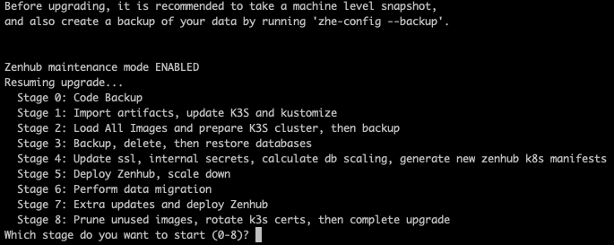

<div align="center">
  
</div>

[Website](https://www.zenhub.com/) • [On-Premise](https://www.zenhub.com/enterprise) • [Releases](https://www.zenhub.com/enterprise/releases/) • [Blog](https://blog.zenhub.com/) • [Chat (Community Support)](https://help.zenhub.com/support/solutions/articles/43000556746-zenhub-users-slack-community)

**Zenhub Enterprise On-Premise as a VM** is the only self-hosted, VM-based team collaboration solution built for GitHub Enterprise Server. Plan roadmaps, use taskboards, and generate automated reports directly from your team’s work in GitHub. Always accurate.

## Table of Contents

- [1. Getting Started](#1-getting-started)
- [2. Requirements](#2-requirements)
  - [2.1 Systems Administration Skills](#21-systems-administration-skills)
  - [2.2 GitHub Enterprise Server](#22-github-enterprise-server)
  - [2.3 Zenhub Enterprise On-Premise License](#23-zenhub-enterprise-on-premise-license)
- [3. Configuration](#3-configuration)
  - [3.1 Deploy the VM](#31-deploy-the-vm)
    - [3.1.1 Platforms](#311-platforms)
    - [3.1.2 Hardware Sizes](#312-hardware-sizes)
    - [3.1.3 Ports](#313-ports)
  - [3.2 Configure Access and Network](#32-configure-access-and-network)
    - [3.2.1 Admin Password](#321-admin-password)
    - [3.2.2 Adding an SSH Key](#322-adding-an-ssh-key)
    - [3.2.3 SSH Known Issues](#323-ssh-known-issues)
    - [3.2.4 Configure a Static IP](#324-configure-a-static-ip)
  - [3.3 Configure Zenhub](#33-configure-zenhub)
    - [3.3.1 Required Values](#331-required-values)
    - [3.3.2 Optional Values](#332-optional-values)
    - [3.3.3 Rightsizing Postgres](#333-rightsizing-postgres)
  - [3.4 SSL/TLS Ingress Certificates](#34-ssltls-ingress-certificates)
    - [3.4.1 Zenhub Application TLS](#341-zenhub-application-tls)
    - [3.4.2 Developer Site TLS](#342-developer-site-tls)
  - [3.5 Private DNS](#35-private-dns)
- [4. Application Deployment](#4-application-deployment)
  - [4.1 Run the Configuration Tool](#41-run-the-configuration-tool)
  - [4.2 Sanity Check](#42-sanity-check)
  - [4.3 Application Check](#43-application-check)
  - [4.4 Publish the Chrome and Firefox Extensions](#44-publish-the-chrome-and-firefox-extensions)
- [5. Upgrades](#5-upgrades)
  - [5.1 Prerequisites](#51-prerequisites)
  - [5.2 Preparing to Upgrade](#52-preparing-to-upgrade)
  - [5.3 Upgrading](#53-upgrading)
  - [5.4 Resuming Upgrades after a Failure](#54-resuming-upgrades-after-a-failure)
- [6. Maintenance and Operational Tasks](#6-maintenance-and-operational-tasks)
  - [6.1 Tasks in the Admin UI](#61-tasks-in-the-admin-ui)
    - [6.1.1 Publishing the Chrome and Firefox Extensions](#611-publishing-the-chrome-and-firefox-extensions)
    - [6.1.2 Setting the first Zenhub Admin (License Governance)](#612-setting-the-first-zenhub-admin-license-governance)
    - [6.1.3 Usage Report](#613-usage-report)
  - [6.2 Maintenance Mode](#62-maintenance-mode)
  - [6.3 Backup/Restore](#63-backuprestore)
    - [6.3.1 Backup](#631-backup)
    - [6.3.2 Restore](#632-restore)
  - [6.4 Support Bundle](#64-support-bundle)
  - [6.5 VM Size Changes](#65-vm-size-changes)
  - [6.6 Configuring a Secondary VM](#66-configuring-a-secondary-vm)
  - [6.7 Disk Management](#67-disk-management)
    - [6.7.1 Viewing Disk Usage](#671-viewing-disk-usage)
    - [6.7.2 Increasing Disk Space](#672-increasing-disk-space)
    - [6.7.3 Recovery From Low Disk Space Outage](#673-recovery-from-low-disk-space-outage)
  - [6.8 License Renewal](#68-license-renewal)
  - [6.9 K3s Certificate Rotation (401 Unauthorized)](#69-k3s-certificate-rotation-401-unauthorized)
  - [6.10 User Management](#610-user-management)
  - [6.11 System Health Check](#611-system-health-check)
  - [6.12 Installing New TLS Certificates](#612-installing-new-tls-certificates)
    - [6.12.1 Zenhub Application TLS](#6121-zenhub-application-tls)
    - [6.12.2 Developer Site TLS](#6122-developer-site-tls)
  - [6.13 API Rate Limits](#613-api-rate-limits)
  - [6.14 OS Update](#614-os-update)
- [7. `zhe-config` Specification](#7-zhe-config-specification)
- [8. Logs](#8-logs)
  - [8.1 Sending Logs to an External Log Aggregator](#81-sending-logs-to-an-external-log-aggregator)
    - [8.1.1 Enhance the Fluentd Configuration](#811-enhance-the-fluentd-configuration)
    - [8.1.2 Build a Dedicated Image with the Plugin Installed](#812-build-a-dedicated-image-with-the-plugin-installed)
    - [8.1.3 Update the Fluentd DaemonSet](#813-update-the-fluentd-daemonset)
    - [8.1.4 Restart the Fluentd DaemonSet](#814-restart-the-fluentd-daemonset)
  - [8.2 Reverting to the Default Log Configuration](#82-reverting-to-the-default-log-configuration)
- [9. Developer Site](#9-developer-site)
- [10. Platform Authentication](#10-platform-authentication)
  - [10.1 GitHub](#101-github)
  - [10.2 Microsoft Entra ID](#102-microsoft-entra-id)
  - [10.3 LDAP](#103-ldap)
  - [10.4 SAML](#104-saml)
- [11. Integrations](#11-integrations)
  - [11.1 Notion](#111-notion)
- [12. AI Features](#12-ai-features)
  - [12.1 Add a Compatible GPU to Your Zenhub VM](#121-add-a-compatible-gpu-to-your-zenhub-vm)
  - [12.2 VM Size Changes](#122-vm-size-changes)
  - [12.3 Install the AI Components](#123-install-the-ai-components)
  - [12.4 AI Features Configuration](#124-ai-features-configuration)
  - [12.5 Verify the AI Setup is Complete](#125-verify-the-ai-setup-is-complete)
- [13. Monitoring (Experimental)](#13-monitoring-experimental)
  - [13.1 Install/Uninstall the Monitoring Components](#131-installuninstall-the-monitoring-components)
  - [13.2 Accessing Grafana and Prometheus](#132-accessing-grafana-and-prometheus)
  - [13.3 Metrics Storage Information](#133-metrics-storage-information)

## 1. Getting Started

This README will be your guide to setting up Zenhub as a virtual machine. If you currently run a Kubernetes cluster and would prefer to set Zenhub up there, please go back to the [**k8s-cluster**](https://github.com/ZenhubHQ/zenhub-enterprise/tree/master/k8s-cluster) folder. If this is your first time using Zenhub On-Premise, please get in touch with us at https://www.zenhub.com/enterprise and join us in our [Community](https://help.zenhub.com/support/solutions/articles/43000556746-zenhub-users-slack-community) so that we can provide you with additional support.

Thank you for your interest in Zenhub!

## 2. Requirements

### 2.1 Systems Administration Skills

Basic systems administration skills are required for set-up. Those deploying the VM should be comfortable with deploying a virtual machine to their chosen hypervisor, making an SSH connection, and using a Linux command line and text editor.

Linux OS upgrades may be performed by the system administrator. Please note that it is the responsibility of the system administrator to determine whether to upgrade.
Please refer to [6.14 OS Update](#614-os-update) for details.

### 2.2 GitHub Enterprise Server

Zenhub Enterprise for VM requires a persistent connection to your own deployment of a recent version of [GitHub Enterprise Server](https://github.com/enterprise). You can find specific version compatibility information in the [release notes](https://github.com/zenhubhq/zenhub-enterprise/releases).

You will need to [set up an OAuth App](https://docs.github.com/en/developers/apps/creating-an-oauth-app) for Zenhub in your GitHub Enterprise Server. We recommend setting up the OAuth App under your primary GitHub Organization:

>**Application name**: Zenhub Enterprise
>
>**Homepage URL**: `https://<subdomain_suffix>.<domain_tld>`
>
>**Application description**:
>
>> Zenhub Enterprise is the only self-hosted, Kubernetes-based team collaboration solution built for GitHub Enterprise Server. Plan roadmaps, use taskboards, and generate automated reports directly from your team’s work in GitHub. Always accurate.
>
>**Authorization callback URL**: `https://<subdomain_suffix>.<domain_tld>/api/auth/github/callback`

### 2.3 Zenhub Enterprise On-Premise License

Zenhub Enterprise On-Premise requires a license to run. This license is an encoded string that is entered as the `enterprise_license_token` secret in the main configuration file. Please contact your Customer Success Manager to receive your token. For new customers, please visit https://www.zenhub.com/enterprise to get in touch with us.

## 3. Configuration

### 3.1 Deploy the VM

#### 3.1.1 Platforms

To deploy the VM, you need the machine image for your hypervisor of choice. Currently, supported platforms include:

- **AWS EC2**
- **VMware**
- **Hyper-V**
- **Azure**
- **KVM**
- **Google Cloud Platform**

To get access to the machine image, simply request it from us at enterprise@zenhub.com. Depending on which platform you will be deploying it to, we may need additional information provided in the email:

For **AWS**, include your **AWS Account ID** and the target **AWS Region** for your deployment. Our team will share the latest AMI with your AWS account in that region.

> ⚠️ **NOTE:** On AWS, provide an SSH key pair when deploying. AWS will create a `ubuntu` user for that key, so you can access the VM using `ssh -i <your-key> ubuntu@<zenhub-hostname>`

For **VMware**, **Azure**, **KVM**, **GCP** or **Hyper-V**, indicate the desired platform in your email and we will send you a pre-signed URL to download the appropriate machine image.

#### 3.1.2 Hardware Sizes

When deploying Zenhub on your VM, Zenhub will check the available hardware resources and scale itself accordingly in order to give your users the most performant Zenhub experience. Out of the box, Zenhub for VM supports the following hardware configurations.

> ⚠️ **NOTE:** User count is an approximation and your use may vary depending on the usage of Zenhub per user.

| Description | Number of users | vCPUs                               | Memory | Disk         | GPU  | GPU memory | EC2 example |
|-------------|-----------------|-------------------------------------|--------|--------------|------|------------|-------------|
| Small       | 10-100          | 4                                   | 16GB   | 90GB+ (SSD)  | 0    | n/a        | m5.xlarge   |
| Medium      | 100-1000        | 8                                   | 32GB   | 250GB+ (SSD) | 0    | n/a        | m5.2xlarge  |
| Large       | 1000-5000       | 16                                  | 64GB   | 500GB+ (SSD) | 0    | n/a        | m5.4xlarge  |
| Small + AI  | 10-100          | 8                                   | 32GB   | 250GB+ (SSD) | 1    | 24GB       | g6.2xlarge  |
| Medium + AI | 100-1000        | 16                                  | 64GB   | 500GB+ (SSD) | 1    | 24GB       | g6.4xlarge  |
| Large + AI  | 1000-5000       | 32                                  | 128GB  | 600GB+ (SSD) | 1    | 24GB       | g6.8xlarge  |
|             | 5000+           | [Contact us](enterprise@zenhub.com) |        |              |      |            |             |


> ⚠️ **NOTE:** Disk utilization depends highly on the number of images and files uploaded to Zenhub, as well as how many backups you are storing on the VM. At 95% disk utilization, container images will start being removed from containerd, with the least recently used images being removed first. Eventually, if disk space is not increased, the kubelet will be forced to remove images that are essential to the running of Zenhub and you will see pods in the **Evicted** state. To recover from a high disk utilization event, reduce the disk utilization and run `zhe-config --images-import`. This will reload the images into containerd.

> ⚠️ **NOTE:** The Zenhub Enterprise OVA for VMware is pre-configured with a 60GB data filesystem and a 20GB root filesystem on ZHE 3.1 and 3.2. ZHE 3.3 and greater is pre-configured with a 30GB root volume. If you launch a VM with a 500GB volume, you will need to [expand the filesystems](#67-disk-management) to occupy the extra space.

#### 3.1.3 Ports

Below, we've summarized the list of ports and firewall rules that the Zenhub Enterprise VM will need to function in your network.

| Type   | Protocol | Port Range | Source                         |
| ------ | -------- | ---------- | ------------------------------ |
| HTTP   | TCP      | 80         | 0.0.0.0/0 or Office IP Range   |
| HTTPS  | TCP      | 443        | 0.0.0.0/0 or Office IP Range   |
| Custom | TCP      | 8443       | IP(s) to access admin-ui       |
| SSH    | TCP      | 22         | Admin IP range or bastion host |
| HTTP   | TCP      | 80         | IP of GitHub Enterprise        |
| HTTPS  | TCP      | 443        | IP of GitHub Enterprise        |

You do not need to set this up inside the VM. This is strictly for any virtual or physical firewalls you have when deploying the VM, such as AWS Security Groups.

### 3.2 Configure Access and Network

#### 3.2.1 Admin Password

The default initial username and password are **both** `zenhub`

> A strong password will be required after the first login.

#### 3.2.2 Adding an SSH Key

One option is to use the provided configuration tool and provide the key:

```bash
zhe-config --sshkey
SSH RSA Public KEY (ssh-rsa AbC123xYz...):
```

Another way is to import a key from another computer/workstation

```bash
ssh-copy-id -i <path_to_key> zenhub@<Zenhub_VM_IP>
```

#### 3.2.3 SSH Known Issues

- Too many authentication failures
- /usr/bin/ssh-copy-id: ERROR:

Some errors while using `ssh-copy-id` or connecting using a password can be caused by multiple ssh keys loaded in the computer/workstation ssh-agent. The flags `PreferredAuthentications=password` and `PubkeyAuthentication=no` can be added to the command to fix the issue.

```bash
ssh-copy-id -o PreferredAuthentications=password -o PubkeyAuthentication=no -i <path_to_key> zenhub@<Zenhub_VM_IP>
```

#### 3.2.4 Configure a Static IP

By default, Zenhub Enterprise uses the dynamic host configuration protocol (DHCP) for DNS settings when DHCP leases provide nameservers.

> Your nameservers must resolve your Zenhub Enterprise instance's hostname.

If a static IP is required, use the provided configuration tool and provide the required information:

```bash
zhe-config --staticip
```

> ⚠️ **NOTE:** The IP address must be entered in CIDR notation. Example: `192.168.1.15/24`

To revert the instance to use DHCP, run:

```bash
zhe-config --dhcp
```

After running these commands, you will either need to reboot your instance or run `sudo netplan apply`

> ⚠️ **NOTE:** If you are remotely connected to your instance (with SSH for example) and you change your instance's IP via the method above, you will be ejected from your connected session.

### 3.3 Configure Zenhub

Access the VM and create a `YAML` configuration file using the below example. Details about what values to set can be found in [section 3.3.1](#331-required-values) below the example.

```yaml
---
## Required values
zenhub_configuration:
  DOMAIN_TLD:
  SUBDOMAIN_SUFFIX:
  GITHUB_HOSTNAME: https://
  GITHUB_APP_ID:
  GITHUB_APP_SECRET:
  ENTERPRISE_LICENSE_TOKEN:
  ADMIN_UI_PASS:
  CHROME_EXTENSION_WEBSTORE_URL:
  MANIFEST_FIREFOX_ID: zenhub-enterprise@<your-company-domain.com>
## (Optional) Configure API Rate Limits
  # GRAPHQL_OPERATION_LIMIT:
  # GRAPHQL_RUNTIME_LIMIT:
  # REST_API_REQUEST_LIMIT:
  # REST_API_TIME_LIMIT:
## (Optional) Configure Notion Integration
  # NOTION_ENABLED:
  # NOTION_CLIENT_ID:
  # NOTION_CLIENT_SECRET:
## (Optional) Configure Entra ID as an authentication provider
  # AUTHV2_ENTRA_ID_ENABLED: true
  # AUTHV2_ENTRA_ID_CLIENT_ID:
  # AUTHV2_ENTRA_ID_CLIENT_SECRET:
  # AUTHV2_ENTRA_ID_TENANT_ID:
## (Optional) Configure LDAP as an authentication provider
  # AUTHV2_LDAP_ENABLED: true
  # AUTHV2_LDAP_HOST:
  # AUTHV2_LDAP_PORT:
  # AUTHV2_LDAP_METHOD:
  # AUTHV2_LDAP_BASE:
  # AUTHV2_LDAP_BIND_DN:
  # AUTHV2_LDAP_BIND_PASSWORD:
  # AUTHV2_LDAP_USER_FILTER:
## (Optional) Configure SAML as an authentication provider
  # AUTHV2_SAML_ENABLED: true
  # AUTHV2_SAML_IDP_METADATA_URL:
  # AUTHV2_SAML_SP_ENTITY_ID:
## (Optional) Enable AI features if you have a GPU available
  # AI_FEATURES_ENABLED: true

## Optional VM configurations

## Set below to true to let Zenhub installation generate the self-signed certificate
# ssl_self_signed: true

## To set custom kubernetes cluster CIDR
##  Please ensure your subnet mask is between 16 and 20 for both the cluster and service space to allow the cluster to operate normally
##  The below CIDR cannot overlap with each other
# k8s_cidr:
#   cluster_cidr: 10.x.0.0/16
#   service_cidr: 10.x.0.0/16

## To add ssh key to the default user. Multiple keys can be added
# ssh_keys:
#   key1: ssh-rsa 123xxx...
#   key2: ssh-rsa

## To set static IP
# ip:
#   static: true
#   dhcp: false
#   address: "xxx.xxx.xxx.xxx/xx"
#   gateway: "xxx.xxx.xxx.xxx"
#   dns: "xxx.xxx.xxx.xxx, yyy.yyy.yyy.yyy"

## To set custom NTP servers
# chrony:
#   primary: 0.ubuntu.pool.ntp.org
#   secondary:

## To set custom Fail2Ban configuration
##  Must set "custom: true"
##  Can add your network IP as follows: "fail2ban_ignoreips: "127.0.0.1/8 ::1 <your-network-IP/32>"
##  "fail2ban_ignore_users" should be a list format as provided below
# fail2ban:
#   custom: true
#   fail2ban_loglevel: INFO
#   fail2ban_logtarget: /var/log/fail2ban.log
#   fail2ban_ignoreself: "true"
#   fail2ban_ignoreips: "127.0.0.1/8 ::1 <network-IP>/32"
#   fail2ban_bantime: 600
#   fail2ban_findtime: 600
#   fail2ban_maxretry: 6
#   fail2ban_banaction: "ufw"
#   fail2ban_ignore_users:
#     - zenhub
#     - ubuntu

## Credentials to upload support bundles to a secure S3 bucket
# upload_bundle_vars:
#   SUPPORT_BUNDLE_ACCESS_KEY:
#   SUPPORT_BUNDLE_SECRET_KEY:
```

### 3.3.1 Required Values

- `DOMAIN_TLD` : Set your top-level domain where Zenhub will be served from. This is used to tell the Zenhub web app how to
  reach the Zenhub APIs.
- `SUBDOMAIN_SUFFIX` : Set the subdomain that Zenhub will be served from, or leave it as the default "zenhub" value.
- `GITHUB_HOSTNAME` : Make sure the value includes `https://` and does not have a trailing slash.
- `GITHUB_APP_ID` : Specify the OAuth App ID for the Zenhub application. See here for instructions on how to set up an OAuth
  app on your GitHub server: https://docs.github.com/en/developers/apps/creating-an-oauth-app
- `GITHUB_APP_SECRET` : The OAuth secret value that corresponds with the above OAuth App ID.
- `ENTERPRISE_LICENSE_TOKEN` : The Zenhub license (JWT) you should have received by email from the Zenhub team. If you do not have a license, reach out to enterprise@zenhub.com.
- `ADMIN_UI_PASS` : The password to the Zenhub Admin UI, which runs on port 8443 and is used to execute several administrative tasks such as publishing extensions, usage reporting, and creating a Zenhub Admin for license administration.
- `CHROME_EXTENSION_WEBSTORE_URL` : The URL of your published Chrome extension. If you have not published a Zenhub extension before, this will be blank for your first configuration. After publishing the extension, set this variable and re-run your configuration to activate the Chrome extension installation link on Zenhub's landing page.
- `MANIFEST_FIREFOX_ID` : The UUID used by the Firefox add-on store to uniquely identify your Firefox extension. Ex. zenhub-enterprise@your-company-domain.com

> ⚠️ **NOTE:** Always use the same `MANIFEST_FIREFOX_ID`. This enables your users to receive an automatic update rather than reinstalling the extension. You can find this value in the [Mozilla Add-On Developer Hub](https://addons.mozilla.org/developers/) by clicking Edit Product Page and scrolling down to UUID on your existing extension.

### 3.3.2 Optional Values

#### Application Configuration

These should be nested under zenhub_configuration along with the "Required Values".

##### API Rate Limits

- `GRAPHQL_OPERATION_LIMIT`: Sets the rate limit for concurrent requests on the GraphQL API per token.
- `GRAPHQL_RUNTIME_LIMIT`: Sets the rate limit in milliseconds for the total amount of process time per minute per token for GraphQL API.
- `REST_API_REQUEST_LIMIT`: Sets the number of requests the legacy REST API will serve in a given **REST_API_TIME_LIMIT** before rate limiting.
- `REST_API_TIME_LIMIT`: Sets the timespan in seconds that the legacy REST API will use to calculate rate limiting.

##### AI Features

- `AI_FEATURES_ENABLED`: Enables AI features if you have a GPU available. Drivers must be installed separately, please see [section 12](#12-ai-features) for more information.

##### Authentication Providers

Zenhub Enterprise 4.0 and greater supports several external authentication methods. You can enable one or more of these authentication methods by setting the corresponding environment variables.

###### ENTRA ID (Formerly Azure AD)
> ⚠️ **NOTE:** If you are performing an upgrade and have previously configured Entra ID using `AUTHV2_AZURE_AD_*`, no changes to your configuration file are required. Your existing configuration will remain compatible and continue to function as expected.

- `AUTHV2_ENTRA_ID_ENABLED`: Enables Entra ID as an authentication provider
- `AUTHV2_ENTRA_ID_CLIENT_ID`: Entra ID client ID. Example: `12345678-abcd-1234-abcd-1234567890ab`
- `AUTHV2_ENTRA_ID_CLIENT_SECRET`: Entra ID client secret. Example: `U75zD5Zet4`
- `AUTHV2_ENTRA_ID_TENANT_ID`: Entra ID tenant ID. Example: `abcdefgh-4321-abcd-4321-abcdefgh1234`

###### LDAP

- `AUTHV2_LDAP_ENABLED`: Enables LDAP as an authentication provider
- `AUTHV2_LDAP_HOST`: LDAP host. Example: `ldap.example.com`
- `AUTHV2_LDAP_PORT`: LDAP port. Example: `389` for plain or `636` for ssl
- `AUTHV2_LDAP_METHOD`: LDAP method. Example: `plain` or `ssl`
- `AUTHV2_LDAP_BASE`: LDAP base. Example: `dc=example,dc=com`
- `AUTHV2_LDAP_BIND_DN`: LDAP bind DN. Example: `cn=admin,dc=example,dc=com`
- `AUTHV2_LDAP_BIND_PASSWORD`: LDAP bind password.
- `AUTHV2_LDAP_USER_FILTER`: LDAP user filter. Example: `(&(objectclass=inetOrgPerson)(uid=%<username>s))`

###### SAML

- `AUTHV2_SAML_ENABLED`: Enables SAML as an authentication provider
- `AUTHV2_SAML_IDP_METADATA_URL`: Metadata URL linking to the identity provider's SAML config
- `AUTHV2_SAML_SP_ENTITY_ID`: Entity ID of the service provider

##### Notion Integration

- `NOTION_ENABLED`: Enables the Notion integration
- `NOTION_CLIENT_ID`: The OAuth client ID from notion.so/my-integrations
- `NOTION_CLIENT_SECRET`: The OAuth client secret from notion.so/my-integrations

#### VM Configuration

These should be in their own sections, not nested under zenhub_configuration. Commented examples are present in the file example above.

> ⚠️ **NOTE:** `k8s_cidr` values can only be set during the initial installation of k3s, which occurs during the **first** run of `zhe-config --config-file <file.yaml>`. Once set, it cannot be changed on a running cluster.

- `ssl_self_signed`: Generate a new self-signed SSL certificate during installation

> ⚠️ **NOTE:** Please ensure your subnet mask is between 16 and 20 for both the cluster and service space to allow the cluster to operate normally. Please make sure that `cluster_cidr` and `service_cidr` do not overlap.
- `k8s_cidr`: Assign a custom CIDR for the internal kubernetes network
  - `cluster_cidr`: IPv4/IPv6 network CIDRs to use for pod IPs. If unset, defaults to 10.42.0.0/16
  - `service_cidr`: IPv4/IPv6 network CIDRs to use for service IPs. If unset, defaults to 10.43.0.0/16
- `ssh_keys`: SSH key(s) to be included as authorized_keys
- `ip`: Configure the VM to use static IP
- `chrony`: Configure the VM to use custom NTP servers for your environment
- `upload_bundle_vars`: Configuration for uploading support bundles to a secure s3 bucket
  - `SUPPORT_BUNDLE_ACCESS_KEY`: AWS access key provided by Zenhub Support
  - `SUPPORT_BUNDLE_SECRET_KEY`: AWS secret key provided by Zenhub Support

### 3.3.3 Rightsizing Postgres

Zenhub Enterprise includes a pre-configured Postgres database with default settings optimized for typical usage. However, as your data volume and query frequency increase, you may need to adjust these settings to ensure optimal performance.

To rightsize Postgres, monitor its memory usage during peak activity periods. Based on this analysis, determine the necessary adjustments to CPU and memory allocations to accommodate your workload effectively.

Once the necessary CPU and memory values are determined, please adjust and save the below file to `/opt/zenhub/configuration/postgres-config.yaml`. Replace `<input>` with your determined values.


```yaml
# Postgres ConfigMap
# max_stack_depth = maximum is 7MB
# shared_buffers = ~25% of requested memory for Postgres
# effective_cache_size = ~70% of total memory
# work_mem = ~5% of total memory
# max_connections = 100, since pgbouncer has default_pool_size set to 90
# maintenance_work_mem = ~10% of total memory
# random_page_cost = 1.1 for SSD
kind: ConfigMap
apiVersion: v1
metadata:
  name: zhe-postgres-conf
data:
  zhe-postgres.conf: |-
    max_stack_depth = '<input>MB'
    shared_buffers = '<input>MB'
    effective_cache_size = '<input>GB'
    work_mem = '<input>MB'
    max_connections = '100'
    maintenance_work_mem = '<input>MB'
    random_page_cost = '1.1'
---
# raptor-postgresql
apiVersion: apps/v1
kind: StatefulSet
metadata:
  name: database-raptor-postgresql
spec:
  template:
    spec:
      containers:
        - name: postgresql
          resources:
            requests:
              cpu: <input>m
              memory: <input>G
            limits:
              memory: <input>G
```

Lastly, update Postgres with the new settings by running: `zhe-config --reload`

### 3.4 SSL/TLS Ingress Certificates

An SSL/TLS certificate needs to be provided to establish secure connections with the application.

If you need to know how to update existing certificates without downtime, see section [6.12 Installing New TLS Certificates](#612-installing-new-tls-certificates).

#### 3.4.1 Zenhub Application TLS

Generate a passwordless certificate for your main application domain, like `https://<subdomain_suffix>.<domain_tld>`

Copy the certificate and key pair to the following path:

`${ZENHUB_HOME}/configuration/ssl/tls.key` - certificate private key

`${ZENHUB_HOME}/configuration/ssl/tls.crt` - certificate

> ⚠️ **NOTE:** The application comes with self-signed certificates set up by default. If you want to provide your own certificates, you can safely replace the self-signed certificates with your own.

> ⚠️ **NOTE:** The certificate and key must be named `tls.crt` and `tls.key` as in the example above.

> ⚠️ **NOTE:** Zenhub will automatically generate a new self-signed certificate if `ssl_self_signed` is set to `true` in the configuration file. Set `ssl_self_signed` to `false` or leave it unset if you want to provide your own self-signed certificates.

#### 3.4.2 Developer Site TLS

Generate a passwordless certificate for your developer site domain, like `https://developers-<subdomain_suffix>.<domain_tld>`

Copy the certificate and key pair to the following path:

`${ZENHUB_HOME}/configuration/ssl/developer-site/tls.key` - certificate private key

`${ZENHUB_HOME}/configuration/ssl/developer-site/tls.crt` - certificate

> ⚠️ **NOTE:** The application comes with self-signed certificates set up by default. If you want to provide your own certificates, you can safely replace the self-signed certificates with your own.

> ⚠️ **NOTE:** The certificate and key must be named `tls.crt` and `tls.key` as in the example above.

### 3.5 Private DNS

When using a private DNS server, it is necessary to update the CoreDNS configuration for K3S to resolve private addresses. The Zenhub Enterprise VM sets the manifests directory for the K3S server at `/opt/k3s/server/manifests`. CoreDNS, which is utilized by K3S, automatically detects and applies configurations from a ConfigMap named `coredns-custom`. The filename for the Kubernetes resource specification can be any name, provided it resides within this directory.

Here is an example of the `coredns-custom` Kubernetes spec.
In this configuration, upstream queries for the private domains zenhub.app and zenhub.info will be forwarded to 169.254.169.254.

```bash
apiVersion: v1
kind: ConfigMap
metadata:
  name: coredns-custom
  namespace: kube-system
data:
  private.server: |
    zenhub.app:53 {
      forward . 169.254.169.254
    }
    zenhub.info:53 { 
      forward . 169.254.169.254
    }
```


## 4. Application Deployment

### 4.1 Run the Configuration Tool

Run the configuration tool with your completed configuration file:

```bash
zhe-config --config-file <configuration_file_full_path>
```

> Your Zenhub Enterprise application will then configure itself and start up.

### 4.2 Sanity Check

Before moving on to check the application, it can also be beneficial to check the status of the pods to ensure they all have the status of `Running` or `Completed`:

```bash
sudo kubectl -n zenhub get pods
```

### 4.3 Application Check

To verify that your deployment was successful, you should be able to visit the Zenhub application, log into the web app, load/create a Workspace, and see a board with issues.

Additionally, a good test is to open Zenhub in two separate browser tabs. In tab #1, move an issue on the board from one pipeline to another. Check tab #2 to verify that the issue moved.

Finally, check that you can access the developer site at `https://developers-<subdomain_suffix>.<domain_tld>`. For more information about the developer site, read section [9. Developer Site](#9-developer-site)

### 4.4 Publish the Chrome and Firefox Extensions

See section [6.1.1](#611-publishing-the-chrome-and-firefox-extensions) for instructions to publish the extensions.

## 5. Upgrades

Zenhub Enterprise Server is continuously evolving, bringing in new features and resolving bugs through feature updates and patch releases. You are responsible for upgrading your instance.

We highly suggest updating your instance _at least_ once every 12 months to avoid issues related to outdated software.

### 5.1 Prerequisites

To successfully upgrade, ensure you have sufficient disk space available on your VM. Your disk should be at least 20% free, and you want to ensure you do not reach 90% utilization after the upgrade as this can cause adverse affects on the stability of Zenhub Enterprise. You can check the [Disk Management](#67-disk-management) documentation to see how to check and increase disk space if needed.

### 5.2 Preparing to Upgrade

⚠️ **NOTE:** Starting in version 4.2, you can now upgrade from two minor versions behind the latest release. For example, if the latest release is 4.2.8, you can upgrade from 4.0.X or 4.1.X.

1. Before upgrading, you should always check the release notes for the version you are upgrading to. You can find the release notes for each version in the [releases](https://github.com/ZenHubHQ/zenhub-enterprise/releases) section of this repository. You must ensure you are upgrading to a version that is compatible with your GitHub Enterprise Server version. The release notes list the GitHub Enterprise Server versions that are compatible with each Zenhub Enterprise release.

2. To obtain an upgrade bundle, [contact our team](mailto:enterprise@zenhub.com) to get the link. You can download the file to your instance directly using `curl`:

```bash
curl -o zhe_upgrade.run "<link-to-upgrade-bundle>"
```

If you cannot download the file directly to your instance, you can download it to your local machine and then upload it to your instance using `scp` or your choice of tool.

> ⚠️ **NOTE:** The file integrity is checked automatically via an integrated **checksum** when the upgrade is run. If you want to check the file integrity without running the upgrade, run `bash zhe_upgrade.run --check`

3. Finally, **we highly recommend taking a VM or disk snapshot of your VM**. This will allow you to roll back to the previous version if you encounter any issues during or after the upgrade. To ensure data integrity, we recommend taking a snapshot of your VM while it is powered off, or while the Zenhub application is in maintenance mode to ensure background jobs are not running.

> ⚠️ **NOTE:** If your hypervisor does not support VM snapshots, you can take a snapshot of the disk instead. This will allow you to restore the disk to the previous state if needed.

### 5.3 Upgrading

Once you are ready to upgrade, follow the steps below. These instructions include the use of the `tmux` terminal multiplexer to ensure the upgrade is not interrupted by a network disconnect.

1. Create a new tmux session named "upgrade" and run the upgrade bundle while inside the tmux session:

```bash
tmux new-session -s "upgrade"
```

```bash
bash zhe_upgrade.run
```

If you become disconnected from the VM during the upgrade, you can reconnect to the tmux session by running: `tmux attach-session -t upgrade`

You can manually detach from the tmux session by pressing: `Ctrl+b` and then `d`. The upgrade will continue to run in the background.

You can list all tmux sessions by running: `tmux ls`

2. Once the upgrade is complete, be sure you are connected to the "upgrade" tmux session and then end the tmux session by running: `exit`

> ⚠️ **NOTE:** If you observe any problems during or after the upgrade, please record the problem and [contact our team](mailto:enterprise@zenhub.com) with the details, including your upgrade log which can be found as `/var/log/zenhub/zhe-upgrade-<timestamp>`. Then, feel free to revert your instance to the previous version using the VM or disk snapshot you took before the upgrade.
>
> If you are unable to use a VM or disk snapshot to revert, there is a data backup created during the start of the upgrade process that you can use to restore your instance to the previous version. You can find the backup in `/opt/snapshots` timestamped with the date the upgrade was run. In this situation, please [contact our team](mailto:enterprise@zenhub.com) for assistance.

3. Publish an update to the Chrome and Firefox extensions. See section [6.1.1](#611-publishing-the-chrome-and-firefox-extensions) for more information.

### 5.4 Resuming Upgrades After a Failure

We have added an option to resume from a failing upgrade. This functionality was introduced because upgrades can take a long time to complete.

> ⚠️ **NOTE:** Before resuming the upgrade, please contact [enterprise@zenhub.com](mailto:enterprise@zenhub.com) to ensure that your environment can safely resume from where it failed.

To resume from a failed upgrade, follow these steps:

1. Run the following command:
  ```bash
  ./<upgrade bundle file> resume <zhe version you are upgrading from>
  ```
  - Example:
    ```bash
    ./zhe_upgrade_4.4.2.run resume
    ```

2. The command will prompt you to select the stage from which you wish to resume the upgrade. Refer to the output of your previous upgrade run to identify the last printed stage.
  - Example log:
    ```
    Stage 5 | Deploy Zenhub
    ```

Example:



## 6. Maintenance and Operational Tasks

### 6.1 Tasks in the Admin UI

Zenhub Enterprise comes with an Admin UI that is used for a number of administrative tasks best suited to a visual user interface. On Zenhub Enterprise for VMs, this Admin UI runs on port 8443 of the application URL: `https://<subdomain_suffix>`.`<domain_tld>:8443`. This application is separate from the main Zenhub application, and since it runs on port 8443 you may use network access controls to expose this application to your system administrators only.

#### 6.1.1 Publishing the Chrome and Firefox Extensions

There are two methods to interact with the Zenhub UI:

- The Zenhub web app
- The Zenhub browser extensions for Chrome and Firefox, which allow users access to the power of Zenhub from within the UI of GitHub Enterprise

To use the extensions with GitHub Enterprise, you must publish your own versions of them. The first time you publish the extensions, you will need to set up a Chrome Developer account and a Mozilla Developer account before creating a new extension in each platform. When application updates are applied, you will publish updates to the _existing_ extension on each platform.

For detailed instructions, please visit the Zenhub Enterprise Admin UI (`https://<subdomain_suffix>`.`<domain_tld>:8443`).

> ⚠️ **NOTE:** After the Chrome extension is published, you will need to get the URL of the published extension and put it into your configuration file as `CHROME_EXTENSION_WEBSTORE_URL`. With this value entered, re-run your configuration. This will ensure the link to download the Chrome extension on the application landing page is active.

#### 6.1.2 Setting the first Zenhub Admin (License Governance)

Zenhub provides a method of license governance that is enforced across the entire set of GitHub Enterprise users. By default, any user of the connected GitHub Enterprise Server can access, install, and use Zenhub Enterprise On-Premise. If you would like to control access to Zenhub, you will need to promote one or more users to be Zenhub Admins.

Zenhub Admins can be created from the Admin UI (`https://<subdomain_suffix>`.`<domain_tld>:8443/settings`). This mechanism exists to ensure only a privileged user can create the first Zenhub Admin. Existing Zenhub Admins can also promote existing Zenhub users to Admin from within the Zenhub web app.

For more information on License Governance, please view [this article](https://help.zenhub.com/support/solutions/articles/43000559760-license-governance-in-zenhub-enterprise) in our Help Center.

#### 6.1.3 Usage Report

Since Zenhub Enterprise On-Premise is a completely self-contained system in your environment, we require a monthly usage report to be sent to us in order to ensure your Zenhub usage aligns with your billing. The usage report can be found in the Admin UI at `https://<subdomain_suffix>.<domain_tld>:8443/usage` and sent to enterprise@zenhub.com.

### 6.2 Maintenance Mode

When operating a ZHE deployment, you may face situations in which you would like to prevent users from accessing the application (such as restoring a database backup). For this purpose, we have included a **maintenance mode** in the `zhe-config` script.

Maintenance mode can be enabled in two ways:

1. _Automatically_, when Zenhub detects that GitHub is in maintenance mode. Zenhub checks GitHub for this status every 30 seconds.
2. _Manually_, when a system administrator determines it is necessary to gracefully block user access to the application.

Enable maintenance mode:

```bash
zhe-config --maintenance enable
```

Disable maintenance mode:

```bash
zhe-config --maintenance disable
```

### 6.3 Backup/Restore

Zenhub snapshots contain database data and files/images uploaded to the Zenhub web app by users.

#### 6.3.1 Backup

Backups use the database engine backup capability, are not intrusive, and can be run at any time by running the following from the VM:

```bash
zhe-config --backup
```

- A snapshot of Zenhub will be created in `/opt/snapshots/<yyyy-mm-ddThh-mm>`
- The script will silently erase any existing snapshots found under the same date in `/opt/snapshots`
- No rotation is set up by default—please monitor your snapshot's usage

#### 6.3.2 Restore

Restores require the existing databases to be dumped and started fresh. The restore script executes the following process:

1. Configure the persistent volumes to be recycled
2. Abruptly shut down all Zenhub containers
3. Delete all databases/caches and associated volumes (all their data)
4. Create new databases/caches
5. Restore the snapshots in the databases
6. Restart Zenhub containers

```bash
zhe-config --restore <snapshot_name>
```

- Before dumping the running databases, the snapshot to be restored will be tested for existence, but not for integrity

### 6.4 Support Bundle

To help our support team troubleshoot issues you might have, a support bundle including logs and configuration can be generated with:

```bash
zhe-config --support-bundle
```

It will generate an archive that can be found under `${ZENHUB_HOME}/support-bundle`.


To send this bundle to Zenhub support, you can use our built-in bundle uploader. Before running this command, you must first configure AWS access keys as described in section [3.3 Configure Zenhub](#33-configure-zenhub)
```bash
zhe-config --upload-bundle <path_to_support_bundle>
```


### 6.5 VM Size Changes
> ⚠️ **NOTE:** For hard drive size changes, see section [6.7](#67-disk-management)

If you have increased or decreased the amount of CPUs or RAM available to your VM running Zenhub Enterprise, you can use the `zhe-config` tool to scale the application to fit the new hardware size. Here is the general re-size process to follow:

1. SSH onto your Zenhub VM and put Zenhub into maintenance mode

```bash
zhe-config --maintenance enable
```

2. Re-size your VM according to your hosting provider's instructions
3. SSH onto your Zenhub VM and scale Zenhub

```bash
zhe-config --reload
```

### 6.6 Configuring a Secondary VM

If you would like to set up a secondary Zenhub Enterprise VM for staging or disaster recovery, it is important to configure it correctly so that the configuration values are compatible with the data being restored from the primary VM.

1. Follow sections [3.1](#31-deploy-the-vm) and [3.2](#32-configure-access-and-network) to deploy your secondary VM
2. Copy `/opt/zenhub/configuration/internal.secret.env` from your primary VM and place it on your secondary VM at the same folder location
3. Fill out your secondary's [configuration file](#33-configure-zenhub) and run the configuration

   > ⚠️ **NOTE:** If the secondary is being used for disaster recovery, we recommend using the same configuration values for both environments, and controlling which is "active" with DNS. If you want to have two environments running in parallel (such as for staging) you can set up a second OAuth App in GitHub Enterprise and set different values for `SUBDOMAIN_SUFFIX`, `GITHUB_APP_ID`, `GITHUB_APP_SECRET`, `MANIFEST_FIREFOX_ID` and `CHROME_WEBSTORE_URL`.

   > ⚠️ **NOTE:** If you are running ZHE 3.2 or greater, it is important to set a configuration value called `LOCKBOX_MASTER_KEY` in your [configuration file](#33-configure-zenhub) to the value found in `/opt/zenhub/configuration/internal.secret.env`. This environment variable was not present in ZHE before version 3.2. This environment variable must be maintained across VMs that are using the same data.

4. Create a [backup](#631-backup) on your primary VM
5. [Restore](#632-restore) the backup on your secondary VM

Repeat the backup and restore steps as regularly as desired to keep your secondary environment up to date.

### 6.7 Disk Management

Zenhub Enterprise for VM makes use of local storage for databases, files, pictures, application images, a local registry, etc. Your disk usage must be kept below 90% to keep the OS and application running smoothly.

Disk management varies between different hosts, and you are responsible for managing your disk usage. We have provided some tools and documentation to assist you.

#### 6.7.1 Viewing Disk Usage

Check the disk usage on Zenhub Enterprise for VM via the command below, which omits to display the overlay and temp filesystems used and managed by K3S.

```bash
df -h -x tmpfs -x overlay
```

#### 6.7.2 Increasing Disk Space

**AWS and similar platforms**

For platforms like AWS which use elastic storage, manual management of the disk via the operating system is not required; You just need to follow the documentation of your hosting provider to increase your disk space.

**VMware and similar platforms**

For platforms like VMWare, resize or add an additional hard drive and then use the instructions below to resize your filesystem:

> ⚠️ **NOTE:**  While these steps can be performed on a live environment, a mistake while writing to the partition table can corrupt your disk. We recommend taking a snapshot prior to carrying out disk related activities.

1. Enter the fdisk utility

```bash
sudo fdisk /dev/sda
```

2. Create a new partition of your desired additional size

```bash
n        (create a new partition)
enter    (use the default partition number)
enter    (use the default first sector)
+sizeG   (eg. to create a 20 gigabyte partition, enter +20G)
w        (write to the partition table to save your changes)
```

3. Create a physical volume on the new partition

```bash
sudo pvcreate /dev/sda<new-partition-number>   (eg. /dev/sda5)
```

<details>
  <summary>If increasing the root filesystem '/'</summary>

  4. Extend the volume group

  ```bash
  sudo vgextend ubuntu-vg /dev/sda<new-partition-number>
  ```

  5. Extend the logical volume

  ```bash
  sudo lvextend -l +100%FREE /dev/ubuntu-vg/ubuntu-lv /dev/sda<new-partition-number>
  ```

  6. Resize the filesystem

  ```bash
  sudo resize2fs /dev/ubuntu-vg/ubuntu-lv
  ```
</details>

<details>
  <summary>If increasing the data filesystem `/opt`</summary>

  4. Extend the volume group

  ```bash
  sudo vgextend data-vg /dev/sda<new-partition-number>
  ```

  5. Extend the logical volume

  ```bash
  sudo lvextend -l +100%FREE /dev/data-vg/data-lv /dev/sda<new-partition-number>
  ```

  6. Resize the filesystem

  ```bash
  sudo resize2fs /dev/data-vg/data-lv
  ```
</details>

Once you have completed the steps above, the system will be using the extra disk space you have added.

#### 6.7.3 Recovery From Low Disk Space Outage
If your root or /opt filesystem reaches 90% disk capacity, the Kubernetes scheduler can start deleting images and evicting pods. If this occurs, Zenhub will not function.

Clear disk space, or increase the available disk space using the steps in section [6.7.2](#672-increasing-disk-space), and then run the following command to reload any deleted images back into your VM's local registry:

```bash
zhe-config --images-import
```

Then, delete the `Evicted` pods, which can cause issues with upgrades if not removed:

```bash
sudo kubectl -n zenhub delete pods --field-selector=status.phase=Failed
```

### 6.8 License Renewal
The environment variable `ENTERPRISE_LICENSE_TOKEN` mentioned in section [3.3](#33-configure-zenhub) is your software license for Zenhub. When you get a new license, you'll need to update the value for `ENTERPRISE_LICENSE_TOKEN` in your `configuration.yaml` file, then use the `zhe-config` tool to apply your new license.

1. Update the value for `ENTERPRISE_LICENSE_TOKEN`

```bash
vim configuration.yaml
```

2. Apply the new license using the updated configuration file

```bash
zhe-config --update-license $(pwd)/configuration.yaml
```

> ⚠️ **NOTE:** If you have misplaced your `configuration.yaml` file, you can find a backup of the current running configuration at `$ZENHUB_HOME/configuration/configuration.yaml`.

### 6.9 K3s Certificate Rotation (401 Unauthorized)

If you encounter a situation where you running a backup, support bundle, or upgrade, and you see a `401 Unauthorized` error message, your Kubernetes certificates have likely expired. These certificates are used to establish trust with the K8s API and are automatically refreshed whenever you perform a Zenhub upgrade.

If Zenhub has not been updated within the last 12 months and the certs have expired, they can be updated by running the following command to restart the systemd service called `k3s`, which will renew the certificates if they are expired or are within 90 days of expiring:

```bash
sudo systemctl restart k3s
```

In order to proactively manage these certificates, we suggest regularly updating Zenhub, at a minimum of once every 12 months. You can confirm when your certificates will expire by running:

```bash
sudo su
for i in `ls /opt/k3s/server/tls/*.crt`; do echo $i; openssl x509 -enddate -noout -in $i; done
```

Then, take note of when your certificates expire and plan to either perform a Zenhub upgrade or restart the `k3s` service running on your VM within that 90 day period.


### 6.10 User management

The Zenhub Enterprise VM for VMware ships with a default Ubuntu user called 'zenhub' which is used for some internal operations and has also been set up for administrators to optionally use to safely interact with the appliance. The password for this user is set up to expire after 60 days by default. Note that the application will continue to operate normally even if the 'zenhub' user password expires.


Some basic operations that may be needed to manage this user are:

Changing the password:

```bash
sudo passwd zenhub
```

Changing the number of days before the next password expiration:

```bash
sudo chage zenhub -M <NUMBER_OF_DAYS_TO_EXPIRATION>
```

### 6.11 System Health Check

Health check does the following:

1. Checks for K3S internal certificates that are expiring within 30 days.
2. Checks if K3S service is up and running.
3. Checks if your Zenhub Enterprise license will expire in 30 days.
4. Checks if the root disk space is above 90% utilized.
5. Checks if ZHE has any issues that will prevent an upgrade

To run:

```bash
zhe-config --health-check
```

### 6.12 Installing New TLS Certificates

If you are **replacing an old certificate**, you can apply the certificate without running a full [application deployment](#4-application-deployment) using the methods below

#### 6.12.1 Zenhub Application TLS

1. Replace the `tls.key` and `tls.crt` in `${ZENHUB_HOME}/configuration/ssl` with your new key and certificate
2. Run the `zhe-config --update-tls` command to apply the new certificate

#### 6.12.2 Developer Site TLS

1. Replace the `tls.key` and `tls.crt` in `${ZENHUB_HOME}/configuration/ssl/developer-site` with your new key and certificate
2. Run the `zhe-config --update-tls` command to apply the new certificate

### 6.13 API Rate Limits

You can configure the rate limits of both the legacy REST API as well as the GraphQL API by updating and applying the main configuration yaml file that was created in section [3.3 Configure Zenhub](#33-configure-zenhub).

The [Optional Values](#332-optional-values) section outlines what to add to your configuration yaml file to configure your rate limits.

Apply the updated configuration to the app as per section [4.1 Run the Configuration Tool](#41-run-the-configuration-tool). Please note that running the configuration tool will cause a brief downtime while the application restarts.

### 6.14 OS (Ubuntu) Updates

The host is currently based on Ubuntu 22-04 LTS and the cluster (Kubernetes) is managed by a systemd service (`k3s`) with its own upgrade mechanism.

All the workloads are running in the cluster, as containers (`containerd`) are updated as such.

The Debian utility `unattended-upgrades` is enabled and set up to automatically apply _security updates_ (only) once per day.


It is the responsibility of the system administrator to determine the scheduling and running of other package upgrades on the linux OS.
Outlined below are the steps a system administrator is recommended to take:
 
1. SSH onto your Zenhub VM and put Zenhub into maintenance mode

```bash
zhe-config --maintenance enable
```

2. Create a VM snapshot according to your hosting provider's instructions (strongly recommended)

3. Perform the upgrade
```bash
sudo apt-get update
sudo apt-get dist-upgrade
```

4. Restore the ZHE service

```bash
zhe-config --maintenance disable
```

5. Verify that the service is up and running

```bash
zhe-config --health-check
```


## 7. `zhe-config` Specification

The configuration tool `zhe-config` has been included to help with various administration tasks, as you have likely already seen throughout the documentation. This is a full list of the options available for the `zhe-config` tool.

```bash
*********************************
*** Zenhub Configuration Tool ***
*********************************

A tool for configuring, deploying, and managing your Zenhub Enterprise appliance.

Usage:
  zhe-config [Options]

Examples:
  zhe-config --config-file /your/path/config.yaml
  zhe-config --restore 2023-05-17T21-37
  zhe-config --maintenance enable
  zhe-config --upload-bundle /opt/zenhub/support-bundle/support_bundle_2023-05-17-T213724-UTC.tar

Options:
  --backup                        Create a backup of databases and files
  --chrony-ntp                    Set custom NTP servers in chrony
  --config-example                Show a configuration file example
  --config-file    FILE_PATH      Deploy Zenhub from a configuration file
  --dhcp                          Configure the VM to use DHCP
  --fail2ban                      Configure fail2ban using configuration supplied to /opt/zenhub/configuration/configuration.yaml
  --health-check                  Run a health check to validate the status of Zenhub Enterprise
  --help                          Show this help message
  --images-import                 Re-import container images
  --maintenance    enable|disable Enable or disable maintenance mode
  --reload                        Redeploy Zenhub using the last applied configuration
                                  and scale the application based on hardware resources available
  --restore        BACKUP_NAME    Restore from a backup in /opt/snapshots
  --sshkey                        Add an SSH key manually
  --staticip                      Configure the VM to use static IP
  --support-bundle                Generate a support bundle in /opt/zenhub/support-bundle
  --update-license FILE_PATH      Update license from configuration file with updated ENTERPRISE_LICENSE_TOKEN
  --update-tls                    Update Zenhub to use new TLS cert and key placed at:
                                  /opt/zenhub/configuration/ssl/tls.crt
                                  /opt/zenhub/configuration/ssl/tls.key
  --upload-bundle  BUNDLE_PATH    Upload a support bundle to a secure AWS storage bucket for Zenhub Support to access
  --version                       Display the current Zenhub Version

More details about Zenhub configuration can be found at:
https://github.com/ZenhubHQ/zenhub-enterprise/tree/master/virtual-machine
```

## 8. Logs

Zenhub Logs are available `/var/log/zenhub/<type>.<service_name>.log`, archived daily as
`/var/log/zenhub/<type>.<service_name>.log.tar.gz.<date>` and rotated weekly.

`<type>` is either `database` or `application`. `service_name` refers to a different component of Zenhub Enterprise
(in short, a different container).

### 8.1 Sending Logs to an External Log Aggregator

Internally, [Fluentd](https://www.fluentd.org/) is used to collect logs, and you can adapt the configuration to send logs to an external log aggregator of your choice.

Fluentd offers a wide range of [output plugins](https://www.fluentd.org/plugins/all#input-output) like AWS Cloudwatch, GCP Stack Driver, New Relic, Logz.io, and more.

Once you found the plugin for your need, follow the steps below to configure Zenhub to forward logs.

#### 8.1.1 Enhance the Fluentd Configuration

- Copy the Fluentd configuration `cp ${ZENHUB_HOME}/kustomizations/fluentd/fluentd.conf ${ZENHUB_HOME}/configuration/custom-fluentd.conf`
- Add the `<match application.*>` and/or `<match database.*>` which correspond to the chosen plugin.
- There is an example for [Google Cloud Stack Driver](https://cloud.google.com/logging/docs/agent/configuration) you can use as a reference.

#### 8.1.2 Build a Dedicated Image with the Plugin Installed

- Get the sample Dockerfile from `${ZENHUB_HOME}/kustomizations/fluentd/Dockerfile` and add your plugin.
- The provided sample Dockerfile installs the Stack Driver plugins with `sudo gem install fluent-plugin-google-cloud`, update it to reflect your plugin installation process.
- Build the image and load it onto the VM. You can do this with the following code snippet:

```bash
# from a context with the Dockerfile and a Docker daemon available
docker build . -t custom/fluentd:your-plugin
docker save custom/fluentd:your-plugin customfluentd.tar
scp customfluentd.tar zenhub@your-zhe-instance:/opt/zenhub/cluster-images/customfluentd.tar
# from your vm (ssh zenhub@your-zhe-instance)
ctr images import /opt/zenhub/cluster-images/customfluentd.tar
```

#### 8.1.3 Update the Fluentd DaemonSet

Run the following commands:

```bash
cd ${ZENHUB_HOME}/kustomizations/fluentd
kustomize edit set image fluentd=custom/fluentd:your-plugin
```

- Edit `kustomizations/fluentd/fluentd-daemonset.yaml`, updating the configMapGenerator to use your custom configuration file instead of the original. See the example below:

**Original**

```yaml
configMapGenerator:
  - name: fluentdconf
    files:
      - fluentd.conf
```

**Updated**

```yaml
configMapGenerator:
  - name: fluentdconf
    files:
      - ../../configuration/custom-fluentd.conf
```

#### 8.1.4 Restart the Fluentd DaemonSet

Run the following commands:

```bash
# restart
kubectl -n kube-system rollout restart daemonset/fluentd
# get fluentd logs
kubectl -n kube-system logs -f -l "app.kubernetes.io/name=fluentd-logging" --tail=1000 -f
```

- Log in to the app, generate some changes and you should see them appear in your external log aggregator.

> Disclaimer: At the moment, the Zenhub upgrade process overrides `${ZENHUB_HOME}/kustomizations/fluentd`. You will have to repeat section 6.1.3 after a Zenhub upgrade if you are running the `prepare-cluster.sh` script or wish to restart Fluentd.

### 8.2 Reverting to the Default Log Configuration

If you wish to remove your log aggregator setup and revert to our default out-of-box configuration, perform the following:

1. Undo the changes made in section 6.1.3
   - Set fluentdconf to be `fluentd.conf`
   - Run `kustomize edit set image fluentd=us.gcr.io/zenhub-public/fluentd:zhe-4.4.2`
2. Perform the steps in section 6.1.4

## 9. Developer Site

Zenhub Enterprise comes with a static developer site that contains documentation for the GraphQL API that is available to developers who want to automate aspects of using Zenhub.

Once you have [configured](#3-configuration) and [deployed](#4-application-deployment) Zenhub, the developer site is made available at `https://developers-<subdomain_suffix>.<domain_tld>`, via port `443`.

**To initially configure TLS for the developer site**, see section [3.4.2 Developer Site TLS](#342-developer-site-tls)

**To update existing TLS certificates for the developer site**, see section [6.12.2 Developer Site TLS](#6122-developer-site-tls)

_An example of what the developer site looks like and does can be found at: <https://developers.zenhub.com>_

## 10. Platform Authentication

To better support non-technical team members, Zenhub provides a range of authentication options other than connecting through GitHub. This allows team members without a GitHub account to sign up and use Zenhub, saving your organization money on unnecessary GitHub licenses.

These authentication options can be enabled/disabled depending on your organization's needs. You can enable none, one, or multiple authentication options.

Users who sign up using these authentication methods that do not connect their GitHub account cannot view or modify any GitHub issues by default, they are only able to view and use Zenhub Issues. The admins of a GitHub repository can make their repository's issues visible to non GitHub-connected Zenhub users in their Zenhub Workspace settings.

These users can choose to connect their GitHub account at any time which will provide them with full Zenhub functionality. Existing users can also disconnect their GitHub account if they only want to use the Zenhub platform and don't require a GitHub license.

Of the authentication methods listed below, the only one that is enabled by default is GitHub.

> ⚠️ **NOTE:** Users may need to clear their browser cache in order to see the newly enabled authentication options on the login page once they have been applied.

### 10.1 GitHub

- This classic authentication option allows users to sign in via their GitHub account
- This is the default authentication method for Zenhub and cannot be disabled

### 10.2 Microsoft Entra ID

- This authentication option allows users to sign in through Microsoft Entra ID
- An Microsoft Entra ID tenant is required to use this form of authentication
- It can be enabled by setting the [Entra ID](#entra-ad) optional configuration

To configure your Microsoft Entra ID Application for Zenhub, you will need to do the following:

#### Add a New Application via Microsoft Entra ID

Start by going to the Entra ID portal in Microsoft Azure. The URL for this will be `https://portal.azure.com/#view/Microsoft_AAD_IAM/ActiveDirectoryMenuBlade/~/Overview`. Then, follow the steps below:

- Navigate to **Overview** and click `+ Add` > `Enterprise application`
  - Name your application and select the `Integrate any other application you don't find in the gallery (Non-gallery)` option. Then click `Create`.

#### Configure the Application

- Under **Authentication > Platform configurations**, click `Add a platform` and select `Web`.
  - Set the Redirect URI to `https://<subdomain_suffix>.<domain_tld>/api/zenhub_users/auth/azure_activedirectory_v2/callback`. Then click `Configure`.
- Under **Authentication > Front-channel logout URL**, set the URL to `https://<subdomain_suffix>.<domain_tld>/logout`. Then click `Save`.
- Under **Certificates & secrets**, click `+ New client secret`, set a description, and set the expiration to whatever you prefer. Then click `Add`.
- Under **API permissions > Configured permissions**, click `Add a permission` and select `Microsoft Graph`.
  - Select `Delegated permissions` and check the `User.Read` permission. Then click `Add permissions`.

#### Obtain configuration values

There are three values that need to be obtained from your Microsoft Entra ID Application to enable Microsoft Entra ID authentication:

- `AUTHV2_ENTRA_ID_CLIENT_ID`
- `AUTHV2_ENTRA_ID_CLIENT_SECRET`
- `AUTHV2_ENTRA_ID_TENANT_ID`

To obtain `AUTHV2_ENTRA_ID_CLIENT_ID` and `AUTHV2_ENTRA_ID_TENANT_ID`, go to **App registrations > All applications > Your application > Overview**

- The value for `AUTHV2_ENTRA_ID_CLIENT_ID` will be the value for `Application (client) ID` found on the page.
- The value for `AUTHV2_ENTRA_ID_TENANT_ID` will be the value for `Directory (tenant) ID` found on the page.

To obtain `AUTHV2_ENTRA_ID_CLIENT_SECRET`, go to **App registrations > All applications > Your application > Certificates & secrets**

- The value for `AUTHV2_ENTRA_ID_CLIENT_SECRET` will be the value for `Value` found on the page. Click the copy button to copy the value to your clipboard.

In addition to these configuration values, there will be one more configuration value to set in your Zenhub configuration file to enable Microsoft Entra ID authentication. See [Optional Values](#332-optional-values) for which value to set. Then, apply the updated configuration to the app as per section [4.1 Run the Configuration Tool](#41-run-the-configuration-tool). Please note that running the configuration tool will cause a brief downtime while the application restarts.

> ⚠️ **NOTE:** The login option will say Azure AD instead of Microsoft Entra ID since that name change was recent and not yet reflected in the Zenhub UI.

### 10.3 LDAP

- This authentication option allows users to sign in using LDAP
- An existing LDAP server is required to use this form of authentication
- It can be enabled by setting the [LDAP](#ldap) optional configuration

  Ensure that there is an LDAP Bind DN user in your directory being connected that has read access to the LDAP directory. This user will be used to search for the users attempting to sign in.

  See the [Optional Values](#332-optional-values) section for which values to set to configure your Zenhub instance to use LDAP user authentication.

### 10.4 SAML

- This authentication option allows users to sign in using SAML
- An SSO with SAML provider is required to use this form of authentication
- It can be enabled by setting the [SAML](#saml) optional configuration

  To configure your SSO with SAML Application for Zenhub, you will need to set the following values in SAML SSO Application:

  - **Application ACS URL**: `https://<subdomain_suffix>.<domain_tld>/api/zenhub_users/auth/saml/callback`
  - **SAMLSubject NameID**: `email`
  - **SAMLSubject NameID Format**: `urn:oasis:names:tc:SAML:1.1:nameid-format:emailAddress`
  - **Attributes**:
    Service Provider Attribute Name mappings for the following attributes:
    - **Email**: `email`
    - **Name**: `name`

  Once you have configured the application, you will have all the required values available to configure your Zenhub instance. See the [Optional Values](#332-optional-values) section for which values to set.

## 11. Integrations

### 11.1 Notion

Zenhub Enterprise Server can be integrated with Notion to allow users to preview Notion links within Zenhub Issues. This integration is disabled by default and can be enabled by setting the [Notion Integration](#notion-integration) optional configuration.

To create the Notion integration, you will need to do the following:

1. Navigate to <https://www.notion.com/my-integrations> and click `+ New integration`

2. Enter "Basic Information" for your integration
    - Choose an associated workspace that you use for your organization. This is only temporary and will be changed later when the integration is upgraded to use OAuth later.
    - Name your integration whatever you prefer
    - You can download the Zenhub logo from <https://github.com/ZenHubHQ/zenhub-enterprise/blob/master/assets/notion-integration/zenhub-logo.png> and upload it as your integration's logo.

3. After creating the integration, you should be able to navigate to the "Capabilities" section for that integration via the sidebar. Set enabled the following capabilities:
    - Read content
    - Update content
    - Insert content
    - Read user information including email addresses

    Click `Save changes`

4. Navigate to the "Distribution" tab in the sidebar and toggle on the `Do you want to make this integration public?` option. This will allow you to share the integration with your organization. Then fill out the following information:

- Organization Information

  - **Company name**: `<your company name>`
  - **Website or homepage**: `https://www.zenhub.com/`
  - **Privacy policy**: `https://www.zenhub.com/privacy-policy`
  - **Terms of use**: `https://www.zenhub.com/terms-of-service`
  - **Support email**: `support@zenhub.com`

- OAuth Domain & URIs
  
  - **Redirect URI**: `https://<subdomain_suffix>.<domain_tld>/api/zenhub_users/auth/notion/callback`

  Click `Submit`

5. After submitting the integration, you should be able to navigate to the "Secrets" tab in the sidebar. Copy the `OAuth client ID` and `OAuth client secret` values and set them in your Zenhub configuration file. See the [Optional Values](#332-optional-values) section for which values to set.

## 12. AI Features

Zenhub Enterprise Server v4.2 and greater has AI driven features that can be enabled to help save time and improve productivity. These features are powered by a large language model (LLM) that is securely hosted alongside the Zenhub application, wherever you run your virtual machine. The AI features are disabled by default. To enable them, there are several steps that need to be taken to ensure that the LLM can be set up and run correctly.

- Add a compatible GPU to your Zenhub VM
- Increase the VM size and add disk space if needed
- Install the CUDA drivers, dependencies, and AI image
- Configure the AI features in the Zenhub configuration file to enable them within the application

Each of these steps has been outlined below in more detail to help you get started with the AI features in Zenhub Enterprise Server.

### 12.1 Add a Compatible GPU to Your Zenhub VM

Our AI features require an NVIDIA GPU with at least 24GB of VRAM to be available on your Zenhub VM. You can add a GPU to your VM by following the instructions provided by your hosting provider. If you're running on a cloud provider, you can typically add a GPU to your VM by changing the VM type to one that includes a GPU.

### 12.2 VM Size Changes

Adding a self-hosted LLM to Zenhub Enterprise for VM increases the resource requirements for running the application and the LLM. You will need to increase the amount of CPUs and RAM available to your VM to maintain the performance of the application to suit the number of users and the size of the data you have. Please consult the [hardware sizes](#312-hardware-sizes) section for more information on the recommended hardware sizes for running Zenhub with the AI features enabled.

In addition to increasing the amount of CPUs and RAM available to your VM, you will also need to increase the amount of disk space available to your VM to accommodate the LLM and its dependencies. We recommend having at least 100GB in free space available before enabling the AI features. Please consult the [disk management](#67-disk-management) section for more information on how to increase disk space.

### 12.3 Install the AI Components

Once you have added a GPU to your Zenhub VM and have increased the system resources as specified above, you will need to install the necessary drivers, dependencies, and AI image. We have created an AI installation package that will install all the necessary components for you. Please [contact our team](mailto:enterprise@zenhub.com) with your Zenhub version, and we will provide you with a signed link to download the AI installation package for your version of Zenhub.

You can download the file to your instance directly using `curl`:

```bash
curl -o zhe_ai_install.run "<link-to-ai-install-bundle>"
```

Then, run the installation script (Some components to be installed are large, so the installation process may take some time to complete):

```bash
bash zhe_ai_install.run
```

The package will install the necessary drivers, dependencies, and the AI container image for you.
Lastly, once the installation is complete, you will need to restart the K3S service:

```bash
sudo systemctl restart k3s
```

You can confirm the state of the installation by running the following:

```bash
sudo kubectl get deploy llama -n zenhub
```

> ⚠️ **NOTE:** The current version of the AI installation package requires an active internet connection to download the necessary components. Please ensure that your Zenhub VM has an active internet connection before running the installation script. The script will need to reach `developer.download.nvidia.com` and any domain listed in `/etc/apt/sources.list` to download the necessary components.

### 12.4 AI Features Configuration

To enable the AI features within the Zenhub application, you will need to set the following values in your Zenhub configuration file:

- `AI_FEATURES_ENABLED`: Set this value to `true`. Please see the [Optional Values](#332-optional-values) section for more information on how to set this value.

Then, apply the updated configuration to the app as per section [4.1 Run the Configuration Tool](#41-run-the-configuration-tool). Please note that running the configuration tool will cause a brief downtime while the application restarts.

### 12.5 Verify the AI Setup is Complete

Once you have completed the steps above, you can verify that the AI setup is complete by checking that the AI features are working within the Zenhub application. You can do this by creating a new issue within Zenhub and checking if there is a "Generate acceptance criteria" button available under the description field when creating the issue. Click the button to generate acceptance criteria for the issue. If the button is available, and you are able to generate acceptance criteria, the AI setup is complete. If you are unable to generate acceptance criteria, please [contact our team](mailto:enterprise@zenhub.com), and we will be happy to assist you!

## 13. Monitoring (Experimental)


This section provides steps to configure a basic monitoring stack.

The components that will be installed are:
1. [Prometheus](https://prometheus.io/docs/introduction/overview/) - Prometheus is a monitoring and alerting toolkit designed to capture and manage metrics data from Kubernetes clusters, providing insights into system performance and health.
- [kube-state-metrics](https://github.com/kubernetes/kube-state-metrics/blob/main/docs/README.md) - Kube-state-metrics is a Kubernetes service that listens to the Kubernetes API server and generates metrics about the state of various Kubernetes objects, which can then be collected by Prometheus for monitoring purposes.
- [node-exporter](https://prometheus.io/docs/guides/node-exporter/) - Node-exporter is a Prometheus exporter that collects hardware and operating system-level metrics from a Linux node, providing detailed insights into system performance and resource usage.
3. [Grafana](https://grafana.com/docs/grafana/latest/) - Grafana is an open-source platform for monitoring and observability, providing tools for visualizing, querying, and analyzing metrics through customizable dashboards.

### 13.1 Install/Uninstall the Monitoring Components

> ⚠️ **NOTE:** The CPU, memory, and storage requirements for the monitoring stack will vary based on the volume of traffic and data processed by Zenhub Enterprise. The Enterprise Administrator is strongly recommended to closely monitor resource usage following installation. Also, please email


The following command will deploy all components outlined above in the **monitoring** namespace: `zhe-config --monitoring-stack deploy`.
To uninstall: `zhe-config --monitoring-stack destroy` will destroy all of the deployed resources in the **monitoring** namespace.

The installation of Grafana comes pre-configured with 2 dashboards to get you started:
1. **Sidekiq**: Provides you with Sidekiq metrics, such as queue latency and enqueued jobs
2. **Zenhub Resource Dashboard**:
   - Kubernetes node-level metrics, such as CPU/Memory utilization
   - Kubernetes pod-level metrics


### 13.2 Accessing Grafana and Prometheus

> ⚠️ **NOTE:** Network access to Grafana and Prometheus is not managed by the installation process through `zhe-config --monitoring-stack deploy`. It will be the responsibility of your administrator to manage and restrict access to the Grafana and Prometheus endpoints.

Once configured, you may navigate to the following endpoints to connect:
1. Prometheus UI - `https://<subdomain_suffix>.<domain_tld>:8443/admin/prometheus`
2. Grafana UI - `https://<subdomain_suffix>.<domain_tld>:8443/admin/grafana`
   - On a fresh install, your credentials will be username **admin** password **admin**
   - It will be the responsibility of your administrator to ensure the password is rotated to a secure one

### 13.3 Metrics Storage Information

Installing the monitoring stack provisions the following Kubernetes PersistentVolumeClaims on the VM: **prometheus-data** (20Gi), mapped to `/opt/monitoring/prometheus` to store WAL data

The configured data retention for both data is 7 days.

> ⚠️ **NOTE:** As the monitoring stack installation is considered experimental, we recommend that the administrator keep a close eye on the growth of the above directories.
